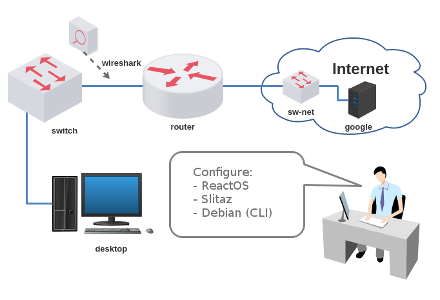
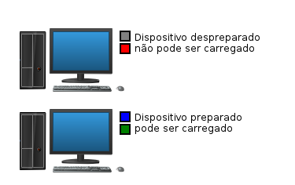
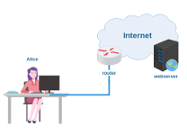
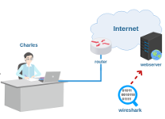

# Lab. Estudo 1A - Modelos de Referência

Tema: Protocolos e Modelos de Referência

Objetivo:
Aprender a configurar três diferentes sistemas para o acesso básico à Internet e identificar os protocolos envolvidos.

Enunciado:
Carregue o laboratório no livelinux e configure o sistema operacional escolhido (Reactos, Slitaz ou Debian) para ter acesso à Internet simulada. Faça um teste de acesso ao site do Google. Identifique os protocolos envolvidos e compare-os aos Modelos TCP/IP e ISO/OSI.

**Passo 1**

Faça o download do laboratório abaixo e execute no livelinux: 

[lab_estudo_1a.tar.gz](./lab_estudo_1a.tar.gz)

O laboratório provavelmente foi salvo em "/home/estudante/Downloads".

`$ cd /home/estudante/Downloads`

`$ pwd`

`$ ls`

Descompacte:

`$ tar -xvzf lab_estudo_1a.tar.gz`

`$ ls`

Acesse:

`$ cd lab_estudo_1a`

`$ ls`

Execute:

`$ py lab.py`

O script solicitará para ser executado como root (senha abc123) e pedirá para preencher o seu nome:

`$ sudo py lab.py SeuNome`

Faça a opção por um dos três sistemas: reactos, slitaz ou debian, exemplo:

`$ sudo py lab.py SeuNome debian`

Aguarde o laboratório carregar!

**Passo 2**

Se você escolheu o Reactos, poderá configurar um sistema operacional semelhante ao Windows. Já o Slitaz é um sistema gráfico do Linux que é minimalista. Para receber auxílio em ambos os sistemas, você poderá acompanhar os seguintes vídeos: 

[Tutorial com Reactos](https://www.youtube.com/watch?v=FLSO8QYKEiI)

[Tutorial com Slitaz](https://www.youtube.com/watch?v=x3jRjl4rLAc)

Se você optou pelo sistema Debian em linha de comando, fica o desafio de conseguir solucionar o acesso à Internet. 

**Passo 3**

Possivelmente esta é a primeira vez que você trabalha com o livelinux nas aulas desta disciplina. Para tanto é importante você saber como funciona o acesso aos dispositivos virtualizados: 

Cada dispositivo possui dois botões:
- Superior (cinza ou azul): serve para preparar o dispositivo do zero. (duplo clique para preparar)
- Inferior (vermelho ou verde): serve para carregar o sistema operacional (boot). (duplo clique para carregar)

**Passo 4**

De acordo com o seu sistema, faça a configuração para ter acesso à Internet conforme a orientação do provedor:

- Endereço IP do Desktop
- Máscara de rede (por enquanto 255.255.255.0)
- Endereço IP da saída padrão (default gateway)
- Endereço IP do servidor de nomes (DNS)

Essas são informações que foram instruídas em sala de aula, se você não participou da aula, pesquise por sua conta na Seção de Materiais deste site.

**Passo 5**

Utilize o navegador Firefox (ou links no Debian) para acessar a página www.google.com.

Se o navegador acessou a página com sucesso, muito bem! Senão, volte ao passo 4, algo está errado.

**Passo 6**

A ferramenta wireshark faz a captura de pacotes da rede, e com ela é possível inspecionar diversos protocolos durante a comunicação.

Carregue a ferramenta wireshark e busque capturar as informações geradas pelos seguintes protocolos:
- Ethernet
- Internet Protocol (IP)
- Transmission Control Protocol (TCP)
- User Datagram Protocol (UDP)
- Hypertext Transfer Protocol (HTTP)
- Domain Name System (DNS)

Busque saber sobre a utilidade de cada um dos protocolos e, principalmente, mapeá-los nos Modelos TCP/IP e ISO/OSI.

Vídeo: [Ilustração de Encapsulamento com Modelo ISO/OSI](https://www.youtube.com/watch?v=pINMJxNX1q4).

**Passo 7**

Se possível volte ao passo 1 e resolva com os outros sistemas. É importante tentar todos: Reactos, Slitaz e Debian.

**Passo 8**

Laboratórios Práticos:

Caso queira treinar antes da prova, você pode testar os seus conhecimentos com os laboratórios abaixo como se estivesse fazendo a prova prática: 

[lab_prat_1a_1.tar.gz](./lab_prat_1a_1.tar.gz)

[lab_prat_1a_2.tar.gz](./lab_prat_1a_2.tar.gz)

Bons estudos!!! :-}

