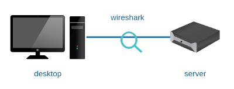
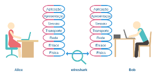
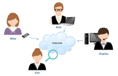

# Lab. Estudo 1B - Modelos de Referência

Tema: Protocolos e Modelos de Referência

Objetivo:
Aprender o processo de encapsulamento realizado pelos protocolos da arquitetura TCP/IP.

Enunciado:
Carregue o laboratório no livelinux, ative a monitoração com a ferramenta wireshark, faça uma consulta DNS e um acesso HTTP. Verifique como esses protocolos foram encapsulados. 

**Passo 1**

Faça o download do laboratório abaixo e execute no livelinux: 

[lab_estudo_1b.tar.gz](./lab_estudo_1b.tar.gz)

**Passo 2**

Esta é uma topologia simples, com pouca comunicação para que você possa analisar o encapsulamento realizado pelos protocolos. O desktop foi endereçado com o IP 10.0.0.2 e o server foi endereçado com o IP 10.0.0.1. Carregue a ferramenta wireshark e note que não está ocorrendo comunicação entre esses hosts, siga para o próximo passo.

Sugestão, tenha em mãos algum material sobre o Modelo de Camadas ISO/OSI e TCP/IP. 

**Passo 3**

Como o DNS é encapsulado?

A máquina server possui uma aplicação de DNS server pré-configurada, porém o único domínio disponível para testes é o "localhost". Sendo assim, execute o seguinte comando na máquina desktop:

`desktop$ dig @10.0.0.1 localhost A`

Verifique as capturas realizadas com a ferramenta wireshark e identifique:
a) Processo de encapulamento. Você encontrou UDP, IP e Ethernet?
b) Com quais camadas do Modelo TCP/IP cada protocolo está relacionado?
c) Com quais camadas do Modelo ISO/OSI cada protocolo está relacionado?
d) Identifique as PDUs (Protocol Data Unit). (mensagem/segmento/datagrama/quadro)

**Passo 4**

Como o HTTP é encapsulado?

A máquina server possui uma página web pré-configurada, realize o acesso pelo navegador lynx ou links:

`desktop$ links 10.0.0.1`

Verifique o pacote capturado pela ferramenta wireshark onde o método GET foi utilizado no protocolo HTTP. Este é um dos pacotes que permite visualizar mais detalhes do encapsulamento. Busque responder o seguinte:
a) Processo de encapulamento. Você encontrou TCP, IP e Ethernet?
b) Com quais camadas do Modelo TCP/IP cada protocolo está relacionado?
c) Com quais camadas do Modelo ISO/OSI cada protocolo está relacionado?
d) Identifique as PDUs (Protocol Data Unit). (mensagem/segmento/datagrama/quadro)

**Passo 5**

Laboratórios Práticos:

Caso queira treinar antes da prova, você pode testar os seus conhecimentos com os laboratórios abaixo como se estivesse fazendo a prova prática: 

[lab_prat_1b_1.tar.gz](./lab_prat_1b_1.tar.gz)

[lab_prat_1b_2.tar.gz](./lab_prat_1b_2.tar.gz)

Bons estudos!!! :-}

