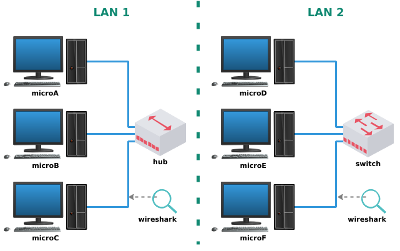

#  Lab. Aula 01 - Ethernet (Hub x Switch)

**Passo 1**

Faça o download do laboratório abaixo e execute no livelinux: 

[lab_aula_1.tar.gz](./lab_aula_1.tar.gz)

**Passo 2**

Descompacte e carregue:

`$ cd Downloads`

`$ ls`

`$ tar -xvzf lab_aula_1.tar.gz`

`$ ls`

`$ cd lab_aula_1`

`$ ls`

`$ sudo py lab.py Seunome`

**Passo 3**

Cada micro possui um script para gerar quadros ethernet: 

`# ls`

ethernet.py

`# py ethernet.py`

**Passo 4**

Siga as instruções de aula:

[Redes 1 - APNP 02a - Hub vs Switch (parte 1)](https://www.youtube.com/watch?v=33YAzgbrjb8)

[Redes 1 - APNP 02b - Hub vs Switch (parte 2)](https://www.youtube.com/watch?v=Gqe0uXs-f9A)

Bons estudos!!!

