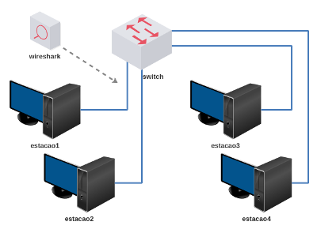

# Lab. Aula 02 - Laboratório Ethernet/ARP

**Passo 1**

Faça o download do laboratório abaixo e execute no livelinux: 

[lab_aula_2.tar.gz](./lab_aula_2.tar.gz)

**Passo 2**

Descompacte e execute como de costume:

`$ ls`

`$ cd Downloads`

`$ ls`

`$ tar -xvzf lab_aula_2.tar.gz`

`$ ls`

`$ cd lab_aula_2`

`$ ls`

`$ py lab.py`

**Passo 3**

Cada micro possui um script para gerar quadros ethernet: 

`# ls`

ethernet.py

`# py ethernet.py`

Para gerar datagramas IP é possível utilizar o hping3 ou o sendip, exemplos:

`# hping3 -0 -H 255 -e "Mensagem" 10.0.0.10 -c 1`

-0 (raw IP)

-e (carga útil)

-c (contador, quantidade de datagramas)

-H (protocolo camada superior ao IP, 255 é desconhecido/reservado)

`# sendip -p ipv4 -is 10.0.0.1 -ip 255 -d "Mensagem" -v 10.0.0.2`

-p (protocolo)

-is (ip de origem)

-ip (protocolo camada superior ao IP)

-d (carga útil)

-v (ip de destino)

Utilize o tcpdump para capturar quadros e datagramas. 

**Passo 4**

Siga as instruções de aula:

[Redes 1 - APNP 03a - Quadro Ethernet (parte 1)](https://www.youtube.com/watch?v=_8PQc3MP_KM)

[Redes 1 - APNP 03b - Quadro Ethernet (parte 2)](https://www.youtube.com/watch?v=AU6_s466z80)

[Redes 1 - APNP 04a Protocolo ARP (parte 1)](https://www.youtube.com/watch?v=uhknZBlDWgs)

[Redes 1 - APNP 04b - Protocolo ARP (parte 2)](https://www.youtube.com/watch?v=0wP2Zt5y-K0)

Bons estudos!!!

