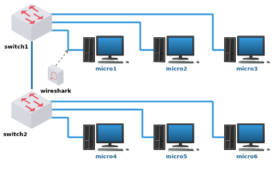

#  Lab. Estudo 1D - Comutação Ethernet e ARP

Tema: Comutação, Protocolos Ethernet e ARP.

Objetivo:
Aprender como funciona o protocolo ARP e identificar endereçamento duplicado.

Enunciado:
Carregue o laboratório no livelinux. Faça o endereçamento IP. Utilize o comando ping entre os dispositivos. Identifique (e teste) endereços duplicados.

**Passo 1**

Faça o download do laboratório abaixo e execute no livelinux: 

[lab_estudo_1d.tar.gz](./lab_estudo_1d.tar.gz)

**Passo 2**

Nesta topologia trabalharemos com o protocolo ARP para traduzir endereços IP para endereços MAC.

Verifique os endereços físicos existentes nos dispositivos, faça o endereçamento lógico.

Utilize o comando ifconfig para endereçar os dispositivos, exemplo:

`# ifconfig eth0 192.168.0.1 netmask 255.255.255.0 up`

Pesquise:
Como funciona o protocolo ARP e qual é a diferença entre endereços físicos e lógicos?

Você saberia responder:
Em qual camada do Modelo OSI se encontra o endereço físico?
Em qual camada do Modelo OSI se encontra o endereço lógico?

**Passo 3**

Antes de realizar qualquer comunicação (ping) entre os dispositivos, verifique como estão as tabelas dos switches e a tabela ARP:

`# arp`

Possivelmente estarão vazias.

**Passo 4**

Agora é o momento de você explorar a topologia e aprender como o ARP funciona.

a) Realize a comunicação entre os dispositivos com o comando ping;

b) Observe os endereços de origem e destino de quadros e datagramas;

c) Observe como as tabelas ARP são construídas;

d) Aproveite a ferramenta wireshark e capture pacotes ARP para a sua análise;

e) Identifique a utilidade de cada campo do cabeçalho do pacote ARP.

**Passo 5**

Neste ponto você deve ter percebido que há endereçamento MAC duplicado. Como você faria para identificar endereços MAC duplicados utilizando apenas os comandos "ping/arp/tcpdump"? Qual o comportamento das comunicações realizadas com os hosts em que o endereço MAC foi duplicado? Pesquise e descubra como modificar o endereço MAC de um desses hosts.

**Passo 6**

Agora um faça um teste duplicando endereços IPs propositalmente. Como você faria para identificar endereços IPs duplicados utilizando apenas os comandos "ping/arp/tcpdump"? Qual o comportamento das comunicações realizadas com os hosts em que o endereço IP foi duplicado?

**Passo 7**

Laboratórios Práticos:

Caso queira treinar antes da prova, você pode testar os seus conhecimentos com os laboratórios abaixo como se estivesse fazendo a prova prática: 

Bons estudos!!! :-}

