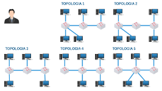

# Lab. Estudo 1C - Comutação Ethernet e ARP

Tema: Comutação, Protocolos Ethernet e ARP.

Objetivo:
Aprender como funciona o dispositivo Hub e o dispositivo Switch. Compreender como os quadros Ethernet são gerados e comutados.

Enunciado:
Carregue o laboratório no livelinux, verifique o endereço MAC dos dispositivos, realize testes de comunicação entre os desktops sem endereçamento IP.

**Passo 1**

Faça o download do laboratório abaixo e execute no livelinux: 

[lab_estudo_1c.tar.gz](./lab_estudo_1c.tar.gz)

**Passo 2**

Nesta topologia temos dispositivos de rede de nível 1 (Hub) e de nível 2 (Switch), ilustrados na figura abaixo: 

Somente o Switch permitirá carregar a tabela Hash para visualização.

Pesquise:
Para entender a principal diferença entre o Hub e o Switch pesquise sobre "Domínios de Colisão".

Você saberia responder:
Quantos são os domínios de colisão nesta topologia? 

**Passo 3**

Utilize o comando "ifconfig" em cada um dos desktops e descubra o seguinte:

- Qual é o seu endereço físico (MAC)?
- Qual é o fabricante da placa de rede (OUI)?

Sugestão: utilize papel e caneta, pois desenhar a topologia pode ajudar na resolução de problemas.

**Passo 4**

Utilize o script ethernet.py!

Todos os desktops possuem um script python que permite enviar quadros Ethernet sem a necessidade do protocolo IP. Você pode até mesmo verificar o código-fonte.

`# ls`

`ethernet.py`

`# cat ethernet.py`

Para utilizar esse script basta executar:

`# py ethernet.py`

O próprio script lhe apresentará instruções de como usá-lo.

**Passo 5**

Bom, agora é o momento de você explorar a topologia para entender como os dispositivos se comunicam. Vai depender da sua curiosidade e da sua desenvoltura para o aprendizado.

Seguem alguns desafios para você testar:

a) Utilize ferramentas para você capturar e analisar os quadros (tcpdump e wireshark). Pesquise a utilidade de cada um dos campos do quadro Ethernet, inspecione bit por bit.

b) Envie quadros para diferentes endereços MAC de destino, teste também o endereço "ff:ff:ff:ff:ff:ff".

c) Analise como as tabelas Hash dos switches são construídas.

d) Desafio: como enviar um quadro entre o desktop1 e o desktop4 cujo conteúdo não pode ser capturado pelos outros desktops.

**Passo 6**

Laboratório Prático:

Caso queira treinar antes da prova, você pode testar os seus conhecimentos com o laboratório abaixo como se estivesse fazendo a prova prática: 

[lab_prat_1c.tar.gz](./lab_prat_1c.tar.gz)

Sugestões:
- Procure resolver sem endereçamento IP;
- Resolva esse laboratório mais de uma vez para melhorar o seu domínio sobre o assunto. 

Bons estudos!!! :-}

