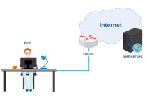
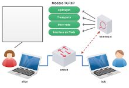
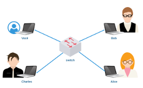
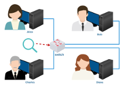
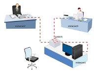

#  Primeira Avaliação - Prática

Objetivo: resolver laboratórios práticos e obter seus tickets. 

**Orientações**

1) Cada laboratório deverá ser executado no LiveLinux xbnet 2.9;

2) Preste atenção quando for carregar o laboratório, preencha corretamente o seu primeiro nome e o seu RA;

3) Estimativa de 15 minutos para resolver cada um dos laboratórios - se estudou antes;

4) Assim que resolver um laboratório salve seu ticket;

*Curiosidade: uma vez que o laboratório era resolvido, o mesmo gerava um ticket/comprovante o qual continha informações cifradas sobre sua solução, o qual eu utilizava para validar se o(a) aluno(a) havia resolvido a prova.*

5) Procure fechar cada laboratório clicando no "x" da janela que foi carregada, assim você não precisará reiniciar o LiveLinux;

*Obs.: ou seja, não feche o terminal diretamente.*

6) Se por acaso lhe pedirem ajuda, dê dicas, mas não dê a resposta.

7) Sinta-se desafiado(a) a resolver sozinho(a)! Boa prova! 

**Laboratório 1A**

Ajude Bob a ter acesso à Internet. 

[lab_avaliacao_1a.tar.gz](./lab_avaliacao_1a.tar.gz)

**Laboratório 1B**

Faça o mapeamento de protocolos e camadas. 

[lab_avaliacao_1b.tar.gz](./lab_avaliacao_1b.tar.gz)

**Laboratório 1C**

Explore os quadros e realize comunicações ponto-a-ponto. 

[lab_avaliacao_1c.tar.gz](./lab_avaliacao_1c.tar.gz)

**Laboratório 1D**

Capture os quadros e faça o levantamento das informações. 

[lab_avaliacao_1d.tar.gz](./lab_avaliacao_1d.tar.gz)

**Laboratório 1E**

Identifique o endereçamento das máquinas de seus colegas. 

[lab_avaliacao_1e.tar.gz](./lab_avaliacao_1e.tar.gz)

