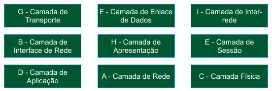

# Primeira Avaliação - Teórica 

**Conteúdo:**  
\- Modelo de Referência ISO/OSI  
\- Modelo de Referência TCP/IP  
\- Protocolo Ethernet e CSMA/CD  
\- Dispositivos Hub e Switch  
\- Protocolo ARP  
\- Listas de Exercícios 1A e 1B  
  
Legenda:  
  
  
  
Bom teste! :)

**Questões**

* * *

15

Cenário: Um usuário em uma estação pretende acessar uma impressora na rede. A imagem abaixo ilustra os dispositivos e seus endereços. A estação precisará fazer a primeira resolução de endereço da impressora e para isso será necessário utilizar o protocolo ARP.  
  
  

Responda: Como serão preenchidos os endereços em um pacote ARP neste caso?

(  )

\- Remetente Hardware: c0:4a:00:75:86:0b  
\- Remetente Protocolo: 172.20.20.17  
\- Alvo Hardware: 64:1c:67:68:e5:db  
\- Alvo Protocolo: 172.20.20.147

(  )

\- Remetente Hardware: c0:4a:00:75:86:0b  
\- Remetente Protocolo: 64:1c:67:68:e5:db  
\- Alvo Hardware: 172.20.20.17  
\- Alvo Protocolo: 172.20.20.147

(  )

\- Remetente Hardware: 64:1c:67:68:e5:db  
\- Remetente Protocolo: 172.20.20.147  
\- Alvo Hardware: c0:4a:00:75:86:0b  
\- Alvo Protocolo: 172.20.20.17

(  )

\- Remetente Hardware: 00:00:00:00:00:00  
\- Remetente Protocolo: 64:1c:67:68:e5:db  
\- Alvo Hardware: 172.20.20.17  
\- Alvo Protocolo: 172.20.20.147

(  )

\- Remetente Hardware: 00:00:00:00:00:00  
\- Remetente Protocolo: 172.20.20.17  
\- Alvo Hardware: 64:1c:67:68:e5:db  
\- Alvo Protocolo: 172.20.20.147

(  )

\- Remetente Hardware: 64:1c:67:68:e5:db  
\- Remetente Protocolo: c0:4a:00:75:86:0b  
\- Alvo Hardware: 172.20.20.147  
\- Alvo Protocolo: 172.20.20.17

(  )

\- Remetente Hardware: 64:1c:67:68:e5:db  
\- Remetente Protocolo: 172.20.20.147  
\- Alvo Hardware: 00:00:00:00:00:00  
\- Alvo Protocolo: 172.20.20.17

(  )

\- Remetente Hardware: 64:1c:67:68:e5:db  
\- Remetente Protocolo: 172.20.20.147  
\- Alvo Hardware: 00:00:00:00:00:00  
\- Alvo Protocolo: 172.20.20.147
(  )

\- Remetente Hardware: 64:1c:67:68:e5:db  
\- Remetente Protocolo: 00:00:00:00:00:00  
\- Alvo Hardware: 172.20.20.147  
\- Alvo Protocolo: 172.20.20.17

(  )

\- Remetente Hardware: 00:00:00:00:00:00  
\- Remetente Protocolo: 64:1c:67:68:e5:db  
\- Alvo Hardware: 172.20.20.147  
\- Alvo Protocolo: 172.20.20.17

* * *

14

De acordo com topologia apresentada na figura abaixo, responda:  
  
  
  
a) Quantos são os domínios de colisão?  
b) Quantos são os dispositivos de redes de Camada 1? (não contabilizar os micros)  
c) Quantos são os dispositivos de redes de Camada 2? (não contabilizar os micros)  
d) Quais micros receberão um quadro originado do micro 1 e destinado para o micro 6? (considere que os dispositivos de Camada 2 conhecem todos os endereços da topologia)

(  )

a) 10 domínios de colisão  
b) 3 dispositivos L1  
c) 2 dispositivos L2  
d) Micros 1, 5 e 6

(  )

a) 6 domínios de colisão  
b) 3 dispositivos L1  
c) 2 dispositivos L2  
d) Micros 2, 5 e 6

(  )

a) 4 domínios de colisão  
b) 3 dispositivos L1  
c) 2 dispositivos L2  
d) Todos os micros

(  )

a) 10 domínios de colisão  
b) 3 dispositivos L1  
c) 2 dispositivos L2  
d) Somente o micro 6

(  )

a) 10 domínios de colisão  
b) 3 dispositivos L1  
c) 2 dispositivos L2  
d) Micros 2, 5 e 6

(  )

a) 6 domínios de colisão  
b) 2 dispositivos L1  
c) 3 dispositivos L2  
d) Todos os micros

(  )

a) 4 domínios de colisão  
b) 3 dispositivos L1  
c) 2 dispositivos L2  
d) Micros 2, 5 e 6

(  )

a) 4 domínios de colisão  
b) 3 dispositivos L1  
c) 2 dispositivos L2  
d) Somente o micro 6

(  )

a) 10 domínios de colisão  
b) 2 dispositivos L1  
c) 3 dispositivos L2  
d) Micros 1, 5 e 6

(  )

a) 6 domínios de colisão  
b) 3 dispositivos L1  
c) 2 dispositivos L2  
d) Somente o micro 6

* * *

13

Responda de acordo com a figura abaixo que foi retirada do Padrão IEEE 802.3:  
  
  
  
A qual protocolo pertence esta PDU (unidade de dados de protocolo)? Verifique também se os campos mencionados estão descritos corretamente.

(  )

Protocolo ARP  
\- Destination/Source Address: identificar destino e origem.  
\- Length/Type: tamanho total da carga útil ou tipo de protocolo da camada superior.  
\- Frame Check Sequence: soma de verificação do quadro para a detecção de erros.

(  )

Protocolo ARP  
\- Destination/Source Address: identificar destino e origem.  
\- Length/Type: tamanho total do quadro ou tipo de protocolo da camada superior.  
\- Frame Check Sequence: soma de verificação do quadro para a correção de erros.

(  )

Protocolo ARP  
\- Destination/Source Address: identificar destino e origem.  
\- Length/Type: tamanho total do datagrama ou tipo de protocolo da camada inferior.  
\- Frame Check Sequence: soma de verificação do datagrama para a correção de erros.

(  )

Protocolo ARP  
\- Destination/Source Address: identificar destino e origem.  
\- Length/Type: tamanho total da carga útil ou tipo de protocolo da camada superior.  
\- Frame Check Sequence: verificação do número de sequência do quadro.

(  )

Protocolo ARP  
\- Destination/Source Address: identificar destino e origem.  
\- Length/Type: tamanho total do datagrama ou tipo de protocolo da camada superior.  
\- Frame Check Sequence: soma de verificação do datagrama para a correção de erros.

(  )

Protocolo Ethernet  
\- Destination/Source Address: identificar destino e origem.  
\- Length/Type: tamanho total do quadro ou tipo de protocolo da camada superior.  
\- Frame Check Sequence: soma de verificação do quadro para a correção de erros.

(  )

Protocolo Ethernet  
\- Destination/Source Address: identificar destino e origem.  
\- Length/Type: tamanho total da carga útil ou tipo de protocolo da camada superior.  
\- Frame Check Sequence: soma de verificação do segmento para a detecção de erros.

(  )

Protocolo Ethernet  
\- Destination/Source Address: identificar destino e origem.  
\- Length/Type: tamanho total do datagrama ou tipo de protocolo da camada superior.  
\- Frame Check Sequence: verificação do número de sequência do quadro.

(  )

Protocolo Ethernet  
\- Destination/Source Address: identificar destino e origem.  
\- Length/Type: tamanho total da carga útil ou tipo de protocolo da camada superior.  
\- Frame Check Sequence: soma de verificação do datagrama para a detecção de erros.

(  )

Protocolo Ethernet  
\- Destination/Source Address: identificar destino e origem.  
\- Length/Type: tamanho total da carga útil ou tipo de protocolo da camada superior.  
\- Frame Check Sequence: soma de verificação do quadro para a detecção de erros.

* * *

12

Responda de acordo com a figura abaixo que foi retirada do Padrão IEEE 802.3:  
  
  
  
Qual frase está correta?

(  )

É um quadro e os campos Destination/Source Address são preenchidos com endereços MACs.

(  )

É um quadro e os campos Destination/Source Address são preenchidos com endereços IPs.

(  )

É um segmento e os campos Destination/Source Address são preenchidos com endereços IPs.

(  )

É um datagrama e os campos Destination/Source Address são preenchidos com números de Portas.

(  )

É uma mensagem e os campos Destination/Source Address são preenchidos com números de Portas.

(  )

É um segmento e os campos Destination/Source Address são preenchidos com números de Portas.

(  )

É uma mensagem e os campos Destination/Source Address são preenchidos com endereços IPs.

(  )

É um segmento e os campos Destination/Source Address são preenchidos com endereços MACs.

(  )

É um datagrama e os campos Destination/Source Address são preenchidos com endereços IPs.

(  )

É um datagrama e os campos Destination/Source Address são preenchidos com endereços MACs.

* * *

11

De acordo com a figura abaixo responda:  
  
  
  
Quais frases estão corretas de acordo com os protocolos e suas unidades de dados?

(  )

\- Os dados que você digitou serão enviados através de um A1 do protocolo C2.  
\- Após a análise dos endereços encontrados na C3 do C4 é que o A3 foi encaminhado.  
\- O wireshark fez a captura de um C1 do protocolo B3.  
\- Houve a perda de um B4 do protocolo A2.

(  )

\- Os dados que você digitou serão enviados através de um A1 do protocolo B3.  
\- Após a análise dos endereços encontrados na C3 do A2 é que o A3 foi encaminhado.  
\- O wireshark fez a captura de um C1 do protocolo C2.  
\- Houve a perda de um B4 do protocolo A4.

(  )

\- Os dados que você digitou serão enviados através de um A1 do protocolo B1.  
\- Após a análise dos endereços encontrados no C1 do C4 é que o A3 foi encaminhado.  
\- O wireshark fez a captura de B2 do protocolo B3.  
\- Houve a perda de um B4 do protocolo A4.

(  )

\- Os dados que você digitou serão enviados através de um A1 do protocolo A4.  
\- Após a análise dos endereços encontrados no C1 do B3 é que o A3 foi encaminhado.  
\- O wireshark fez a captura de B2 do protocolo C4.  
\- Houve a perda de um B4 do protocolo C2.

(  )

\- Os dados que você digitou serão enviados através de um B4 do protocolo B1.  
\- Após a análise dos endereços encontrados na C3 do C4 é que o A3 foi encaminhado.  
\- O wireshark fez a captura de um A1 do protocolo B3.  
\- Houve a perda de um C1 do protocolo A2.

(  )

\- Os dados que você digitou serão enviados através de uma C3 do protocolo C2.  
\- Após a análise dos endereços encontrados nos B2 do B3 é que o A3 foi encaminhado.  
\- O wireshark fez a captura de um B4 do protocolo C4.  
\- Houve a perda de um A1 do protocolo B1.

(  )

\- Os dados que você digitou serão enviados através de uma C3 do protocolo C2.  
\- Após a análise dos endereços encontrados nos B2 do C4 é que o A3 foi encaminhado.  
\- O wireshark fez a captura de um B4 do protocolo B3.  
\- Houve a perda de um A1 do protocolo A4.

(  )

\- Os dados que você digitou serão enviados através de um B4 do protocolo C4.  
\- Após a análise dos endereços encontrados na C3 do B3 é que o A3 foi encaminhado.  
\- O wireshark fez a captura de um A1 do protocolo B1.  
\- Houve a perda de um C1 do protocolo A2.

(  )

\- Os dados que você digitou serão enviados através de uma C3 do protocolo B1.  
\- Após a análise dos endereços encontrados no B4 do C4 é que o A3 foi encaminhado.  
\- O wireshark fez a captura de um C1 do protocolo B3.  
\- Houve a perda de um A1 do protocolo A2.

(  )

\- Os dados que você digitou serão enviados através de uma C3 do protocolo A2.  
\- Após a análise dos endereços encontrados no B4 do C4 é que o A3 foi encaminhado.  
\- O wireshark fez a captura de um C1 do protocolo A4.  
\- Houve a perda de um A1 do protocolo C2.

* * *

10

A figura abaixo ilustra um formulário para a configuração básica de acesso à Internet:  
  
  
  
Sabendo que o administrador da rede forneceu as seguintes informações:  
\- Endereçamento da rede 200.201.10.0 com a máscara 255.255.255.0  
\- A saída padrão para a Internet é o endereço 200.201.10.254  
\- O servidor de resolução de domínios tem o endereço 200.201.10.53  
  
De acordo com os campos destacados na figura, qual seria uma configuração válida para navegar na Internet?

(  )

4 - 200.201.10.53  
3 - 200.201.10.1  
2 - 255.255.255.0  
1 - 200.201.10.2

(  )

4 - 255.255.255.0  
3 - 200.201.10.254  
2 - 200.201.10.1  
1 - 200.201.10.53

(  )

4 - 200.201.10.254  
3 - 200.201.10.254  
2 - 255.255.255.0  
1 - 200.201.10.10

(  )

4 - 200.201.10.200  
3 - 255.255.255.0  
2 - 200.201.10.254  
1 - 200.201.10.53

(  )

4 - 200.201.10.53  
3 - 200.201.10.2  
2 - 255.255.255.0  
1 - 200.201.10.254

(  )

4 - 200.201.10.53  
3 - 255.255.255.0  
2 - 200.201.10.254  
1 - 200.201.10.200

(  )

4 - 200.201.10.251  
3 - 255.255.255.0  
2 - 200.201.10.252  
1 - 200.201.10.253

(  )

4 - 200.201.10.53  
3 - 200.201.10.253  
2 - 255.255.255.0  
1 - 200.201.10.1

(  )

4 - 200.201.10.53  
3 - 200.201.10.254  
2 - 255.255.255.0  
1 - 200.201.10.1

(  )

4 - 200.201.10.52  
3 - 200.201.10.254  
2 - 255.255.255.0  
1 - 200.201.10.200

* * *

9

De acordo com a topologia abaixo, responda:  
  
Considere que todos os dispositivos foram ligados, nenhum protocolo foi ativado, e que suas tabelas "ARP" estão vazias.  
  
  
  
Após ativar e endereçar as interfaces, como ficará a tabela ARP do micro4 logo após executar os seguintes comandos de alcançabilidade?  
  
micro3# ping 172.20.0.14  
micro1# ping 172.20.0.12  
micro4# ping 172.20.0.11

(  )

172.20.0.11 00:e0:d1:81:c7:21  
172.20.0.13 00:e0:d1:a5:48:94  
172.20.0.14 00:e0:d1:e1:d3:a8

(  )

172.20.0.11 00:e0:d1:a5:48:94  
172.20.0.12 00:e0:d1:49:d3:f0  
172.20.0.13 00:e0:d1:81:c7:21

(  )

172.20.0.11 00:e0:d1:a5:48:94  
172.20.0.12 00:e0:d1:49:d3:f0  
172.20.0.14 00:e0:d1:e1:d3:a8

(  )

172.20.0.11 00:e0:d1:a5:48:94  
172.20.0.15 00:e0:d1:13:72:07

(  )

172.20.0.13 00:e0:d1:81:c7:21

(  )

172.20.0.11 00:e0:d1:81:c7:21  
172.20.0.13 00:e0:d1:a5:48:94

(  )

172.20.0.11 00:e0:d1:a5:48:94  
172.20.0.12 00:e0:d1:81:c7:21  
172.20.0.14 00:e0:d1:e1:d3:a8

(  )

172.20.0.13 00:e0:d1:81:c7:21  
172.20.0.14 00:e0:d1:e1:d3:a8

(  )

172.20.0.11 00:e0:d1:a5:48:94

(  )

172.20.0.11 00:e0:d1:a5:48:94  
172.20.0.13 00:e0:d1:81:c7:21

* * *

8

De acordo com a figura abaixo responda:  
  
  
  
Qual correlação está correta?

(  )

B1 <- Transação  
B3 <- Controle de Acesso ao Meio  
A2 <- Datagrama  
A1 <- UDP

(  )

A2 <- Roteamento  
C3 <- DNS  
A1 <- Alicate de Crimp  
B2 <- Bits

(  )

A3 <- Roteamento  
C2 <- Confiabilidade  
B2 <- UTP Categoria 5  
B3 <- UTP Categoria 6

(  )

C1 <- Formato dos dados  
C2 <- Roteamento  
C3 <- Segmento  
A3 <- Cabo Fibra Óptica

(  )

C1 <- Formato dos dados  
C2 <- Testador de Cabos  
C3 <- Mensagem  
A3 <- Encapsulamento

(  )

A2 <- DNS  
A3 <- Roteamento  
B1 <- Datagrama  
B2 <- Cabo Par Trançado

(  )

A2 <- HTTP  
C3 <- Confiabilidade  
A1 <- Quadro  
B2 <- Conector RJ45

(  )

A2 <- Ethernet  
C3 <- Confiabilidade  
B1 <- Mensagem  
B2 <- Cabo Par Trançado

(  )

C2 <- HTTP  
B3 <- Controle de Acesso ao Meio  
A2 <- Mensagem  
A1 <- UTP Categoria 5

(  )

A2 <- DNS  
A1 <- HTTP  
B2 <- Bits  
B3 <- Cabo Coaxial

* * *

7

De acordo com a figura abaixo responda:  
  
  
  
Quais são os modelos de referência e quais são as camadas correspondentes entre esses modelos?

(  )

Modelo X é o Modelo ISO/OSI e o Modelo Y é o Modelo TCP/IP.  
\- Camada 1 de X corresponde à Camada 1 de Y,  
\- Camadas 2 e 3 de X correspondem à Camada 2 de Y,  
\- Camadas 4, 5 e 6 de X correspondem à Camada 3 de Y e  
\- Camada 7 de X corresponde à Camada 4 de Y.

(  )

Modelo X é o Modelo TCP/IP e o Modelo Y é o Modelo ISO/OSI.  
\- Camadas 1 e 2 de X correspondem à Camada 1 de Y,  
\- Camada 3 de X corresponde à Camada 2 de Y,  
\- Camadas 4 e 5 de X correspondem à Camada 3 de Y e  
\- Camadas 6 e 7 de X correspondem à Camada 4 de Y.

(  )

Modelo X é o Modelo TCP/IP e o Modelo Y é o Modelo ISO/OSI.  
\- Camadas 1 e 2 de X correspondem à Camada 1 de Y,  
\- Camada 3 de X corresponde à Camada 2 de Y,  
\- Camada 4 de X corresponde à Camada 3 de Y e  
\- Camadas 5, 6 e 7 de X correspondem à Camada 4 de Y.

(  )

Modelo X é o Modelo TCP/IP e o Modelo Y é o Modelo ISO/OSI.  
\- Camada 1 de X corresponde à Camada 1 de Y,  
\- Camadas 2 e 3 de X corresponde à Camada 2 de Y,  
\- Camada 4 de X corresponde à Camada 3 de Y e  
\- Camadas 5, 6 e 7 de X correspondem à Camada 4 de Y.

(  )

Modelo X é o Modelo TCP/IP e o Modelo Y é o Modelo ISO/OSI.  
\- Camada 1 de X corresponde à Camada 1 de Y,  
\- Camadas 2 e 3 de X correspondem à Camada 2 de Y,  
\- Camadas 4, 5 e 6 de X correspondem à Camada 3 de Y e  
\- Camada 7 de X corresponde à Camada 4 de Y.

(  )

Modelo X é o Modelo ISO/OSI e o Modelo Y é o Modelo TCP/IP.  
\- Camada 1 de X corresponde à Camada 1 de Y,  
\- Camadas 2 e 3 de X corresponde à Camada 2 de Y,  
\- Camada 4 de X corresponde à Camada 3 de Y e  
\- Camadas 5, 6 e 7 de X correspondem à Camada 4 de Y.

(  )

Modelo X é o Modelo ISO/OSI e o Modelo Y é o Modelo TCP/IP.  
\- Camadas 1 e 2 de X correspondem à Camada 1 de Y,  
\- Camada 3 de X corresponde à Camada 2 de Y,  
\- Camada 4 de X corresponde à Camada 3 de Y e  
\- Camadas 5, 6 e 7 de X correspondem à Camada 4 de Y.

(  )

Modelo X é o Modelo ISO/OSI e o Modelo Y é o Modelo TCP/IP.  
\- Camadas 1, 2 e 3 de X correspondem à Camada 1 de Y,  
\- Camada 4 de X corresponde à Camada 2 de Y,  
\- Camada 5 de X corresponde à Camada 3 de Y e  
\- Camadas 6 e 7 de X correspondem à Camada 4 de Y.

(  )

Modelo X é o Modelo TCP/IP e o Modelo Y é o Modelo ISO/OSI.  
\- Camadas 1, 2 e 3 de X correspondem à Camada 1 de Y,  
\- Camada 4 de X corresponde à Camada 2 de Y,  
\- Camada 5 de X corresponde à Camada 3 de Y e  
\- Camadas 6 e 7 de X correspondem à Camada 4 de Y.

(  )

Modelo X é o Modelo ISO/OSI e o Modelo Y é o Modelo TCP/IP.  
\- Camadas 1 e 2 de X correspondem à Camada 1 de Y,  
\- Camada 3 de X corresponde à Camada 2 de Y,  
\- Camadas 4 e 5 de X correspondem à Camada 3 de Y e  
\- Camadas 6 e 7 de X correspondem à Camada 4 de Y.

* * *

6

Responda de acordo com a figura abaixo que foi desenhada conforme o documento RFC 826:  
  
  
  
A qual protocolo pertence esta PDU (unidade de dados de protocolo)? Verifique também se os campos mencionados estão descritos corretamente. (considere a abreviação em siglas)

(  )

Protocolo Ethernet:  
\- Os campos HT, HAL, SHA e THA podem ser usados para endereçamento IP.  
\- Os campos PT, PAL, SPA e TPA podem ser usados para endereçamento MAC.  
\- O campo OC é usado para marcar o pacote como "reply" ou "request".

(  )

Protocolo Ethernet:  
\- Os campos HT, HAL, SHA e SPA podem ser usados para endereçamento MAC.  
\- Os campos PT, PAL, THA e TPA podem ser usados para endereçamento IP.  
\- O campo OC é usado para marcar o pacote como "reply" ou "request".

(  )

Protocolo Ethernet:  
\- Os campos HT, HAL, SHA e THA podem ser usados para endereçamento MAC.  
\- Os campos PT, PAL, SPA e TPA podem ser usados para endereçamento IP.  
\- O campo OC é usado para marcar o pacote como "request" ou "reply".

(  )

Protocolo ARP:  
\- Os campos HT, HAL, SHA e SPA podem ser usados para endereçamento IP.  
\- Os campos PT, PAL, THA e TPA podem ser usados para endereçamento MAC.  
\- O campo OC é usado para marcar o pacote como "request" ou "reply".

(  )

Protocolo IP:  
\- Os campos HT, HAL, SHA e SPA podem ser usados para endereçamento Ethernet.  
\- Os campos PT, PAL, THA e TPA podem ser usados para endereçamento ARP.  
\- O campo OC é usado para marcar o pacote como "reply" ou "request".

(  )

Protocolo ARP:  
\- Os campos HT, HAL, SHA e THA podem ser usados para endereçamento MAC.  
\- Os campos PT, PAL, SPA e TPA podem ser usados para endereçamento IP.  
\- O campo OC é usado para marcar o pacote como "request" ou "reply".

(  )

Protocolo Ethernet:  
\- Os campos HT, HAL, SHA e SPA podem ser usados para endereçamento IP.  
\- Os campos PT, PAL, THA e TPA podem ser usados para endereçamento MAC.  
\- O campo OC é usado para marcar o pacote como "reply" ou "request".

(  )

Protocolo IP:  
\- Os campos HT, HAL, SHA e THA podem ser usados para endereçamento ARP.  
\- Os campos PT, PAL, SPA e TPA podem ser usados para endereçamento Ethernet.  
\- O campo OC é usado para marcar o pacote como "reply" ou "request".

(  )

Protocolo ARP:  
\- Os campos HT, HAL, SHA e THA podem ser usados para endereçamento IP.  
\- Os campos PT, PAL, SPA e TPA podem ser usados para endereçamento ARP.  
\- O campo OC é usado para marcar o pacote como "request" ou "reply".

(  )

Protocolo ARP:  
\- Os campos HT, HAL, SHA e SPA podem ser usados para endereçamento MAC.  
\- Os campos PT, PAL, THA e TPA podem ser usados para endereçamento IP.  
\- O campo OC é usado para marcar o pacote como "request" ou "reply".

* * *

5

De acordo com a figura abaixo:  
  
  
  
Identifique cada um dos pontos de acordo com o Modelo TCP/IP ou Modelo ISO/OSI:

(  )

A - Aplicativo  
B - Camada de Aplicação  
C - Processo de Desencapsulamento  
D - Executa o Protocolo TCP  
E - Tratamento de Quadros

(  )

A - Meio Sem Fio  
B - Camada de Rede  
C - Processo de Desencapsulamento  
D - Executa o Protocolo HTTP  
E - Tratamento de Quadros

(  )

A - Meio Físico  
B - Camada de Transporte  
C - Processo de Encapsulamento  
D - Executa o Protocolo IP  
E - Tratamento de Datagramas

(  )

A - Meio Sem Fio  
B - Camada de Aplicação  
C - Processo de Desencapsulamento  
D - Executa o Protocolo DNS  
E - Tratamento de Segmentos

(  )

A - Meio Físico  
B - Camada de Transporte  
C - Processo de Encapsulamento  
D - Executa o Protocolo IP  
E - Tratamento de Datagramas

(  )

A - Meio Físico  
B - Camada Física  
C - Processo de Encapsulamento  
D - Executa o Protocolo HTTP  
E - Tratamento de Mensagens

(  )

A - Meio Sem Fio  
B - Camada de Interface de Rede  
C - Processo de Desencapsulamento  
D - Executa o Protocolo UDP  
E - Tratamento de Segmentos

(  )

A - Aplicativo  
B - Camada de Inter-rede  
C - Processo de Encapsulamento  
D - Executa o Protocolo Ethernet  
E - Tratamento de Mensagens

(  )

A - Meio Físico  
B - Camada de Transporte  
C - Processo de Desencapsulamento  
D - Executa o Protocolo HTTP  
E - Tratamento de Datagramas

(  )

A - Meio Físico  
B - Camada de Aplicação  
C - Processo de Desencapsulamento  
D - Executa o Protocolo DNS  
E - Tratamento de Datagramas

* * *

4

De acordo com a figura abaixo responda:  
  
  
  
Qual a ordem correta das camadas do Modelo TCP/IP, começando pela camada número 4?

(  )

B, I, G, D

(  )

C, B, G, D

(  )

H, G, A, C

(  )

D, G, I, B

(  )

A, G, E, D

D, G, A, E

(  )

H, G, F, C

(  )

D, G, F, A

(  )

D, E, G, A

(  )

C, F, G, D

* * *

3

De acordo com a figura abaixo responda:  
  
  
  
Qual frase melhor descreve o processo de encapsulamento em um modelo de referência começando pelas camadas superiores?

(  )

Um quadro (D) encapsula um segmento (C); um segmento (C) encapsula um datagrama (B); e um datagrama (B) encapsula uma mensagem (A).

(  )

Uma mensagem (D) encapsula um segmento (C); um segmento (C) encapsula um datagrama (B); e um datagrama (B) encapsula um quadro (A).

(  )

Um segmento (C) encapsula uma mensagem (D); um quadro (B) encapsula um segmento (C); e um datagrama (A) encapsula um quadro (B).

(  )

Um quadro (C) encapsula uma mensagem (D); um datagrama (B) encapsula um quadro (C); e um segmento (A) encapsula um datagrama (B).

(  )

Um datagrama (D) encapsula um quadro (C); um quadro (C) encapsula um segmento (B); e um segmento (B) encapsula uma mensagem (A).

(  )

Um segmento (C) encapsula uma mensagem (D); um datagrama (B) encapsula um segmento (C); e um quadro (A) encapsula um datagrama (B).

(  )

Um quadro (D) encapsula um datagrama (C); um datagrama (C) encapsula um segmento (B); e um segmento (B) encapsula uma mensagem (A).

(  )

Uma mensagem (D) encapsula um quadro (C); um quadro (C) encapsula um datagrama (B); e um datagrama (B) encapsula um segmento (A).

(  )

Um datagrama (C) encapsula uma mensagem (D); um segmento (B) encapsula um datagrama (C); e um quadro (A) encapsula um segmento (B).

(  )

Um segmento (D) encapsula um datagrama (C); um datagrama (C) encapsula uma mensagem (B); e uma mensagem (B) encapsula um quadro (A).

* * *

2

A figura abaixo apresenta as camadas e as suas funções, porém não está organizada adequadamente.  
  
  
  
Quais seriam as funções corretas de cada uma das camadas apresentadas? (considere siglas)

(  )

CR <- ER  
CF <- MFS  
CA <- PA  
CT <- CF  
CED <- CAM

(  )

CR <- ER  
CF <- CAM  
CA <- PA  
CT <- CF  
CED <- MFS

(  )

CR <- CF  
CF <- MFS  
CA <- PA  
CT <- ER  
CED <- CAM

(  )

CR <- PA  
CF <- MFS  
CA <- ER  
CT <- CF  
CED <- CAM

(  )

CR <- MFS  
CF <- CF  
CA <- CAM  
CT <- PA  
CED <- ER

(  )

CR <- ER  
CF <- MFS  
CA <- PA  
CT <- CAM  
CED <- CF

(  )

CR <- CF  
CF <- CAM  
CA <- PA  
CT <- ER  
CED <- MFS

(  )

CR <- CF  
CF <- CAM  
CA <- MFS  
CT <- ER  
CED <- PA

(  )

CR <- CAM  
CF <- ER  
CA <- MFS  
CT <- PA  
CED <- CF

(  )

CR <- CF  
CF <- MFS  
CA <- CAM  
CT <- ER  
CED <- PA

* * *

1

Considere que as tabelas de comutação (hash table) de todos os dispositivos estão vazias e responda:  
  
  
  
a) Se uma unidade de dados de protocolo (PDU) originada de 00:E0:00:B1:B1:B1 for enviada para o endereço 00:E0:00:B2:B2:B2, quais micros irão receber essa informação?  
b) Se uma unidade de dados de protocolo (PDU) originada de 00:E0:00:B1:B1:B1 for enviada para o endereço FF:FF:FF:FF:FF:FF, quais micros irão receber essa informação?  
c) Essa unidade de dados de protocolo (PDU) das perguntas anteriores é: um datagrama, um quadro ou um segmento?

(  )

a) Micros 1, 2, 4, 5 e 6  
b) Micros 1, 2, 4, 5 e 6  
c) Quadro

(  )

a) Somente o Micro 4  
b) Micros 1, 2, 4, 5 e 6  
c) Quadro

(  )

a) Somente o Micro 4  
b) Micros 1, 2, 4, 5 e 6  
c) Datagrama

(  )

a) Micros 1, 2, 4, 5 e 6  
b) Somente o Micro 4  
c) Segmento

(  )

a) Somente o Micro 4  
b) Somente o Micro 4  
c) Quadro

(  )

a) Micros 1, 2 e 4  
b) Somente o Micro 4  
c) Datagrama

(  )

a) Somente o Micro 4  
b) Somente o Micro 4  
c) Segmento

(  )

a) Micros 1, 2, 4, 5 e 6  
b) Micros 1, 2, 4, 5 e 6  
c) Datagrama

(  )

a) Micros 1, 2, 4, 5 e 6  
b) Somente o Micro 4  
c) Quadro

(  )

a) Somente o Micro 4  
b) Micros 1, 2 e 4  
c) Segmento

* * *

15=7; 14=7; 13=10; 12=1; 11=9; 10=9; 9=10; 8=7; 7=7; 6=6; 5=9; 4=4; 3=6; 2=1; 1=1.
