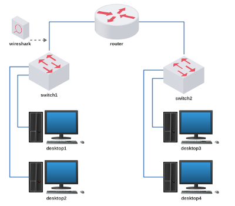

# Lab. Aula 03 - Roteamento Básico

**Passo 1**

Faça o download do laboratório abaixo e execute no livelinux: 

[lab_aula_3.tar.gz](./lab_aula_3.tar.gz)

**Passo 2**

Descompacte e execute como de costume:

`$ ls`

`$ cd Downloads`

`$ ls`

`$ tar -xvzf lab_aula_3.tar.gz`

`$ ls`

`$ cd lab_aula_3`

`$ ls`

`$ py lab.py`

**Passo 3**

Siga as instruções de aula:

[Redes 1 - APNP 05a - Roteamento IP (parte 1)](https://www.youtube.com/watch?v=pg0yT6POt-A)

[Redes 1 - APNP 05b - Roteamento IP (parte 2)](https://www.youtube.com/watch?v=3_jYXz0NiKI)

[Redes 1 - APNP 05c - Roteamento IP (parte 3)](https://www.youtube.com/watch?v=YfUrFVYutUk)

[Redes 1 - APNP 06a - Protocolo IP (parte 1)](https://www.youtube.com/watch?v=M6FxACvZgX4)

[Redes 1 - APNP 06b - Protocolo IP (parte 2)](https://www.youtube.com/watch?v=PjrNY574NgY)

[Redes 1 - APNP 06c - Protocolo IP (parte 3)](https://www.youtube.com/watch?v=Ol07uv2SzYs)

[Redes 1 - APNP 06d - Protocolo IP (parte 4)](https://www.youtube.com/watch?v=Yiw3qTgagX0)

Bons estudos!!!

