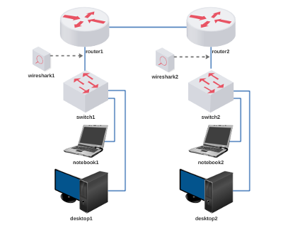

# Lab. Aula 04 - Roteamento Básico II

**Passo 1**

Faça o download do laboratório abaixo e execute no livelinux: 

[lab_aula_4.tar.gz](./lab_aula_4.tar.gz)

**Passo 2**

Descompacte e execute como de costume.

**Passo 3**

Siga as instruções de aula:

[Redes 1 - APNP 07a - Roteamento IP II (parte 1)](https://www.youtube.com/watch?v=vQWcb0qfGlE)

[Redes 1 - APNP 07b - Roteamento IP II (parte 2)](https://www.youtube.com/watch?v=CVrtl7bzs1A)

[Redes 1 - APNP 07c - Roteamento IP II (parte 3)](https://www.youtube.com/watch?v=8V4GRjHIe7I)

Bons estudos!!!

