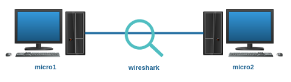

# Lab. Estudo 2A - Protocolo e Roteamento IP

Tema: Protocolo e Roteamento IP

Objetivo:
Aprender como funciona o principal protocolo da Internet, o IP.

Enunciado:
Carregue os micros e os dispositivos do laboratório virtual e utilize a ferramenta wireshark para estudar o cabeçalho dos datagramas IP.

**Passo 1**

Faça o download do laboratório abaixo e execute no livelinux: 

[lab_estudo_2a.tar.gz](./lab_estudo_2a.tar.gz)

**Passo 2**

Nesta topologia trabalharemos com o IP. Os dispositivos já estão endereçados:

Micro1: 10.0.0.1 e fc00::1

Micro2: 10.0.0.2 e fc00::2

Antes de prosseguir com a parte prática busque mais informações em livros e no documento RFC do protocolo IP. 

Você saberia responder:

Em qual camada do Modelo OSI se encontra o IP? 

**Passo 3**

Na sequência estão algumas sugestões para você testar e inspecionar o protocolo IP:

a) Campo "Version"

Hoje temos duas versões do IP em operação na Internet: a versão 4 e a versão 6. Nesta disciplina daremos ênfase ao IPv4, visto que uma vez que tenhamos o domínio do funcionamento deste, ficará mais fácil compreender aquele. Você pode capturar essa informação apenas com o ping:

Em IPv4:

`micro1# ping 10.0.0.2`

Em IPv6:

`micro1# ping6 fc00::2`

Note que estamos nos antecipando com o protocolo ICMP (próximo assunto a ser estudado), pois este será útil para preencher datagramas IPs durante os nossos testes.

b) Campo "Total Length"

É possível modificar o tamanho dos datagramas IPs a partir do ping, exemplos:

`micro1# ping 10.0.0.2 -s 100`

-> 20B IHL

-> 8B ICMP Header

-> 100B ICMP Payload

Qual é o tamanho máximo de um datagrama IP?

c) Campos para indicar Fragmentação

Note que o tamanho máximo permitido para o envio de quadros Ethernet é de 1500 bytes, chama-se de MTU (confira com o comando ifconfig). Datagramas maiores precisam ser fragmentados. Você poderá testar extrapolando o limite, exemplo:

`micro1# ping 10.0.0.2 -s 3000 -c 1`

Inspecione como são utilizados os seguintes campos: Flags, Offset, Identification.

Sugestão, caso queira criar o conteúdo a ser fragmentado, poderá utilizar a ferramenta hping3, exemplo:

`micro1# hping3 -1 -c 1 -d 3000 -E teste.txt 10.0.0.1`

Obviamente o arquivo teste.txt deve conter a informação que deseja fragmentar.

d) Campo "TTL"

Este campo também pode ser modificado pelo comando ping. Pesquise e responda se este campo armazena o tempo em segundos ou a quantidade de saltos.

`micro1# ping -c 1 -t 10 10.0.0.2`

Obs: o campo TTL será melhor explorado nas topologias dos próximos estudos.

e) Campo "Protocol"

Indica qual protocolo está na camada superior. Faça três testes e identifique qual protocolo foi encapsulado. Sugestão: há uma lista padrão de códigos de protocolos controlados pela IANA, pesquise!

`micro1# ping 10.0.0.2 -c 1`

`micro1# dig @10.0.0.2 localhost A`

`micro1# links 10.0.0.2`

Quais os códigos dos protocolos TCP, UDP e ICMP?

f) Campo "Header Checksum"

Por padrão o wireshark vem com a opção de verificação desativada. Apenas ative e faça o teste.

g) Demais campos:

Seria interessante você "escovar" todos os bits do protocolo IP, visto que esse conhecimento lhe ajudará a descobrir e resolver futuros problemas na comunicação de suas aplicações via Internet. Estude!

Sugestão:

Caso queira avançar no assunto, este laboratório possui a ferramenta "sendip", pesquise como funciona e se divirta. 

**Passo 4**

Laboratório Prático:

Caso queira treinar antes da prova, você pode testar os seus conhecimentos com o laboratório abaixo como se estivesse fazendo a prova prática:

[lab_prat_2a.tar.gz](./lab_prat_2a.tar.gz)

*Sugestão: Antes de executar este laboratório sugiro aprender a converter arquivos para base64 e vice-versa.*

Bons estudos!!! :-}

