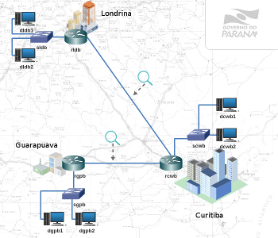

# Lab. Estudo 2B - Protocolo e Roteamento IP

Tema: Protocolo e Roteamento IP

Objetivo:
Aprender como funciona o roteamento de datagramas IPs.

Enunciado:
Considere uma rede de supermercados que se quer fazer uma interconexão com o datacenter principal em Curitiba. Faça a configuração de todos os dispositivos para que a comunicação entre os supermercados de Curitiba, Londrina e Guarapuava se torne possível. Siga corretamente os passos abaixo para cumprir este objetivo. 

**Passo 1**

Faça o download do laboratório abaixo e execute no livelinux: 

[lab_estudo_2b.tar.gz](./lab_estudo_2b.tar.gz)

**Passo 2**

Antes de começar a configuração da topologia, tenha em mãos materiais que lhe auxiliem no endereçamento IP e no roteamento estático básico. 

Você saberia responder:

Em qual camada do Modelo TCP/IP se encontra o roteamento IP? 

**Passo 3**

Se possível faça o desenho da topologia em um papel e realize a distribuição de endereços IPs:

Rede de Curitiba = 192.168.1.0 e máscara 255.255.255.0

Rede de Londrina = 192.168.2.0 e máscara 255.255.255.0

Rede de Guarapuava = 192.168.3.0 e máscara 255.255.255.0

Link entre Curitiba e Londrina = 192.168.4.0 e máscara 255.255.255.0

Link entre Curitiba e Guarapuava = 192.168.5.0 e máscara 255.255.255.0 

**Passo 4**

Faça testes com endereços IPs temporários, ping, arp e tcpdump, para identificar quais interfaces estão conectadas com quais redes.

Faça o endereçamento de todos os dispositivos e de cada interface dentro do seu domínio de broadcast.

Todos os dispositivos vizinhos deverão estar "pingando", ou melhor, alcançando entre si dentro do mesmo domínio de broadcast.

Você saberia responder:

O que é um domínio de broadcast?

Quantos domínios de broadcast possui essa topologia? 

**Passo 5**

Por padrão o sistema operacional Linux não realiza roteamento, então será necessário ativar esse recurso:

Verificar:

`linux-router# sysctl -a | egrep ip_forward`

Ativar:

`linux-router# sysctl net.ipv4.ip_forward=1`

**Passo 6**

Agora é só adicionar as rotas que faltam nos dispositivos de roteamento:

`linux-router# route add -net 192.168.X.0/24 gw 192.168.?.?`

Caso precise remover:

`linux-router# route del -net 192.168.X.0/24`

Neste passo você deve colocar somente as rotas necessárias para que todos os dispositivos tenham conectividade. Não coloque rotas sem necessidade. 

**Passo 7**

Todos os equipamentos deverão "pingar" todos os endereços IPs da topologia. Faça o teste!

Sugestão, use o comando traceroute para verificar o caminho entre origem e destino:

`linux# traceroute -n 192.168.X.Y`

Para parar tecle [CTRL+c]

Você saberia responder:

Como funciona o traceroute? 

**Passo 8**

Este laboratório possui a ferramenta wireshark capturando pacotes em pontos estratégicos da topologia. Para você compreender como funciona Ethernet/ARP/IP e roteamento seria interessante inspecionar os pacotes que passam por esses enlaces.

A cada pacote que você capturar investigue o seguinte:
- Endereços MAC de origem e destino
- Endereços IPs de origem e destino 

**Passo 9**

Laboratórios Práticos:

Caso queira treinar antes da prova, você pode testar os seus conhecimentos com os laboratórios abaixo como se estivesse fazendo a prova prática:

[lab_prat_2b_1.tar.gz](./lab_prat_2b_1.tar.gz)

[lab_prat_2b_2.tar.gz](./lab_prat_2b_2.tar.gz)

Bons estudos!!! :-}

