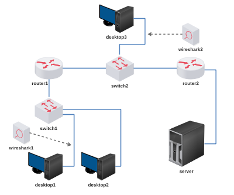

# Lab. Aula 05 - Protocolo ICMP

**Passo 1**

Faça o download do laboratório abaixo e execute no livelinux: 

[lab_aula_5.tar.gz](./lab_aula_5.tar.gz)

**Passo 2**

Descompacte e execute como de costume.

**Passo 3**

Capturar ICMPs:
- do ping
- de rede inalcançável
- de host inalcançável
- de porta inalcançável
- de tempo de vida excedido
- de redirecionamento 

**Passo 4**

Siga as instruções de aula:

[Redes 1 - APNP 08a - Protocolo ICMP (parte 1)](https://www.youtube.com/watch?v=UOdgtoMO518)

[Redes 1 - APNP 08b - Protocolo ICMP (parte 2)](https://www.youtube.com/watch?v=EWTOKsDQzMI)

[Redes 1 - APNP 08c - Protocolo ICMP (parte 3)](https://www.youtube.com/watch?v=8BOLpb-Z7bA)

[Redes 1 - APNP 08d - Protocolo ICMP (Parte 4)](https://www.youtube.com/watch?v=AHricXFLeLM)

[Redes 1 - APNP 09a - ETH/ARP/IP/ICMP (parte 1)](https://www.youtube.com/watch?v=BHTysUmWdYY)

[Redes 1 - APNP 09b - ETH/ARP/IP/ICMP (parte 2)](https://www.youtube.com/watch?v=sdjRZ1asKkA)

[Redes 1 - APNP 09c - ETH/ARP/IP/ICMP (parte 3)](https://www.youtube.com/watch?v=7ql8BzjJcpY)

Bons estudos!!!

