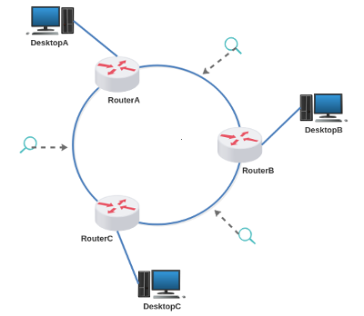

# Lab. Aula 06 - Roteamento Básico III

**Passo 1**

Faça o download do laboratório abaixo e execute no livelinux: 

[lab_aula_6.tar.gz](./lab_aula_6.tar.gz)

**Passo 2**

Descompacte e execute como de costume.

**Passo 3**

Configurar o roteamento da rede do DesktopA para a rede do DesktopC seguindo o caminho no sentido horário.
- Analisar os datagramas ICMP (wireshark) 

**Passo 4**

Configurar o roteamento da rede do DesktopA para a rede do DesktopB seguindo o caminho no sentido anti-horário.
- Analisar os datagramas ICMP (wireshark)

**Passo 5**

Configurar o roteamento para as redes restantes. 

**Passo 6**

Configure o roteamento para uma rede inexistente em looping.
- Observe TTL!

**Passo 7**

Siga as instruções de aula:

[Redes 1 - APNP 10a - Roteamento IP +loop (parte 1)](https://www.youtube.com/watch?v=uz1_ED6dCuM)

[Redes 1 - APNP 10b - Roteamento IP +loop (parte 2)](https://www.youtube.com/watch?v=adBClZ4kznE)

[Redes 1 - APNP 10c - Roteamento IP +loop (parte 3)](https://www.youtube.com/watch?v=Tmt3NEroJmY)

Bons estudos!!!

