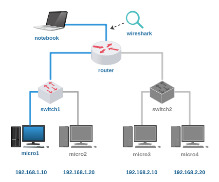
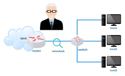
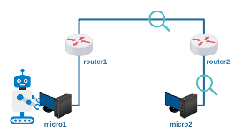

# Lab. Estudo 2C - Roteamento e Protocolo ICMP

Tema: Roteamento e Protocolo ICMP

Objetivo:

Aprender a identificar problemas na rede utilizando o protocolo ICMP.

Enunciado:

A seguinte topologia está parcialmente inativa, utilize o comando ping e analise o protocolo ICMP para identificar problemas nessa rede. 

**Passo 1**

Faça o download do laboratório abaixo e execute no livelinux: 

[lab_estudo_2c.tar.gz](./lab_estudo_2c.tar.gz)

**Passo 2**

Esta topologia possui situações e problemas que podem ser identificadas através do protocolo ICMP, portanto, busque mais informações em documentos RFCs.

Você saberia responder:

Em qual camada do Modelo ISO/OSI se encontra o protocolo ICMP?

**Passo 3**

Esta topologia já está configurada, basta utilizar o notebook para realizar os seus testes de rede.

Para cada teste busque responder o seguinte:
- Qual o tipo e o código de cada datagrama enviado/recebido?
- Qual dispositivo originou tal datagrama?

Teste com o comando ping:

a) O micro1 está alcançável?

b) O micro2 está alcançável?

c) O micro3 está alcançável?

d) O micro4 está alcançável?

Neste teste o micro1 estará com seu acesso web barrado, isso gerará um erro por ICMP, faça um teste com o comando links:

`# links 192.168.1.10`

e) O acesso web ao micro1 está alcançável? 

**Passo 4**

Laboratórios Práticos:

Caso queira treinar antes da prova, você pode testar os seus conhecimentos com os laboratórios abaixo como se estivesse fazendo a prova prática:

[lab_prat_2c_1.tar.gz](./lab_prat_2c_1.tar.gz)

[lab_prat_2c_2.tar.gz](./lab_prat_2c_2.tar.gz)

Bons estudos!!! :-}

