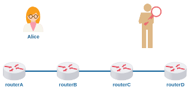
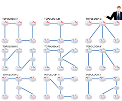

#  Lab. Estudo 2D - Roteamento e Protocolo ICMP

Tema: Roteamento e Protocolo ICMP

Objetivo:

Aprender como os protocolos de Internet podem identificar a quantidade de saltos para alcançar certo destino.

Enunciado:

Configure a topologia virtual com endereçamento e roteamento IP. Primeiro tente identificar a quantidade de saltos entre os laptops utilizando o comando ping, depois utilize o comando traceroute e inspecione os protocolos. 

**Passo 1**

Faça o download do laboratório abaixo e execute no livelinux: 

[lab_estudo_2d.tar.gz](./lab_estudo_2d.tar.gz)

**Passo 2**

Esta topologia permite um estudo mais aprofundado sobre a quantidade de saltos entre dois pontos da rede. Tal informação é útil para identificar pontos de gargalo e alta latência que afetam certas aplicações. Para tanto, é interessante que você tenha em mãos algum material que explica sobre o funcionamento do traceroute.

Você saberia responder:

Como funciona o traceroute? Quais os protocolos envolvidos e como são explorados? 

**Passo 3**

Configure essa topologia com o endereçamento que desejar, faça o roteamento e garanta que o laptop1 possa alcançar o laptop2 e vice-versa.

Você saberia responder:

Quantos são os domínios de broadcast nessa topologia?

**Passo 4**

Identifique a quantidade de saltos entre o laptop1 e o laptop2 utilizando apenas o comando ping:

`laptop1# ping -c 1 [ip_destino] -t N`

Obs: o valor de N deve ser incremental a cada teste, comece com N=1.

Inspecione tanto os cabeçalhos dos datagramas IPs como ICMPs utilizando a ferramenta wireshark. 

**Passo 5**

Identifique a quantidade de saltos entre o laptop1 e o laptop2 utilizando apenas o comando traceroute (ou tracepath):

`laptop1# traceroute -I [ip_destino]`

Obs: a opção "-I" garante que será enviado um datagrama ICMP para teste, ou seja, é possível encapsular outros protocolos como TCP e UDP, teste, investigue, estude.

Você saberia responder:

Qual campo do protocolo IP é utilizado pelo traceroute?

Quais os tipos/códigos de ICMP são explorados pelo traceroute?

**Passo 6**

Laboratórios Práticos:

Caso queira treinar antes da prova, você pode testar os seus conhecimentos com os laboratórios abaixo como se estivesse fazendo a prova prática:

[lab_prat_2d_1.tar.gz](./lab_prat_2d_1.tar.gz)

[lab_prat_2d_2.tar.gz](./lab_prat_2d_2.tar.gz)

Bons estudos!!! :-}

