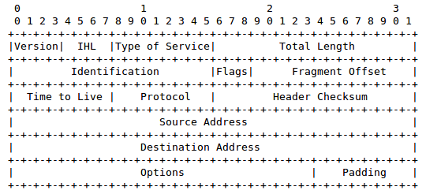
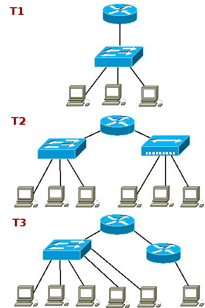
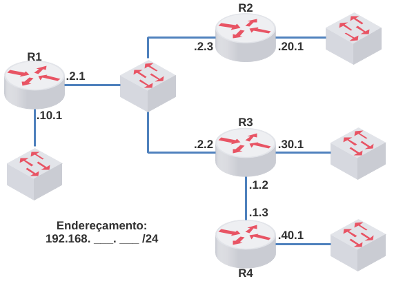
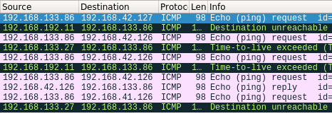
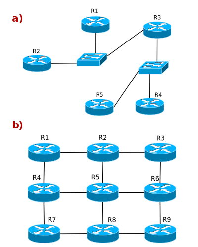
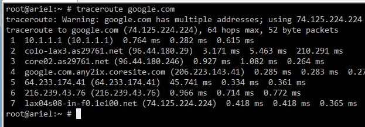
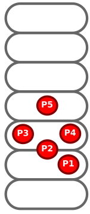
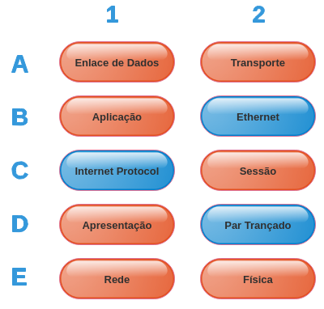
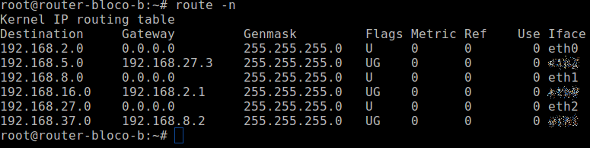

# Segunda Avaliação - Teórica 

**Conteúdo:**

\- Modelos ISO/OSI e TCP/IP (básico)

\- Protocolos Ethernet e ARP (básico)

\- Protocolo IP

\- Roteamento IP

\- Protocolo ICMP

\- Listas de Exercícios 2A e 2B

Bom teste! :)

**Questões**

* * *

13

De acordo com o cabeçalho encontrado no documento RFC 791 (Protocolo IP), responda:  
  
  
  
É corretor afirmar sobre os campos IHL, Total Length e Header Checksum:

(  )

IHL: tamanho total do pacote IP  
Total Length: tamanho total da carga útil pacote IP  
Header Checksum: soma de verificação do pacote IP

(  )

IHL: tamanho total do pacote IP  
Total Length: tamanho total do pacote IP  
Header Checksum: soma de verificação do pacote IP

(  )

IHL: tamanho total da carga útil pacote IP  
Total Length: tamanho total do cabeçalho do pacote IP  
Header Checksum: soma de verificação do cabeçalho do pacote IP

(  )

IHL: tamanho total da carga útil do pacote IP  
Total Length: tamanho total do pacote IP  
Header Checksum: soma de verificação do cabeçalho do pacote IP

(  )

IHL: tamanho total do cabeçalho do pacote IP  
Total Length: tamanho total da carga útil do pacote IP  
Header Checksum: soma de verificação do pacote IP

(  )

IHL: tamanho total do pacote IP  
Total Length: tamanho total do cabeçalho do pacote IP  
Header Checksum: soma de verificação do cabeçalho do pacote IP

(  )

IHL: tamanho total do cabeçalho do pacote IP  
Total Length: tamanho total do pacote IP  
Header Checksum: soma de verificação do cabeçalho do pacote IP

(  )

IHL: tamanho total do pacote IP  
Total Length: tamanho total da carga útil pacote IP  
Header Checksum: soma de verificação da carga útil do pacote IP

(  )

IHL: tamanho total do cabeçalho do pacote IP  
Total Length: tamanho total da carga útil do pacote IP  
Header Checksum: soma de verificação do cabeçalho do pacote IP

(  )

IHL: tamanho total do cabeçalho do pacote IP  
Total Length: tamanho total do pacote IP  
Header Checksum: soma de verificação do pacote IP

* * *

12

A figura abaixo apresenta três topologias:  
  
  
  
Responda:  
Quantos são os Domínios de Colisão (DC) e os Domínios de Broadcast (DB) em cada topologia?

(  )

T1: DC=3 e DB=1  
T2: DC=6 e DB=2  
T3: DC=7 e DB=3

(  )

T1: DC=3 e DB=1  
T2: DC=6 e DB=1  
T3: DC=6 e DB=2

(  )

T1: DC=4 e DB=2  
T2: DC=8 e DB=3  
T3: DC=8 e DB=4

(  )

T1: DC=1 e DB=0  
T2: DC=2 e DB=1  
T3: DC=3 e DB=2

(  )

T1: DC=4 e DB=1  
T2: DC=5 e DB=2  
T3: DC=8 e DB=3

(  )

T1: DC=4 e DB=2  
T2: DC=7 e DB=3  
T3: DC=8 e DB=4

(  )

T1: DC=3 e DB=0  
T2: DC=6 e DB=1  
T3: DC=7 e DB=2

(  )

T1: DC=4 e DB=1  
T2: DC=8 e DB=2  
T3: DC=8 e DB=3

(  )

T1: DC=4 e DB=0  
T2: DC=5 e DB=1  
T3: DC=8 e DB=2

(  )

T1: DC=4 e DB=1  
T2: DC=8 e DB=1  
T3: DC=7 e DB=2

* * *

11

Considere que os roteadores da topologia abaixo já possuem rotas para as redes diretamente conectadas e que o endereçamento IP está corretamente configurado:  
  
  
  
Responda:  
Quantas rotas deverão ser adicionadas em cada roteador para que todos os dispositivos dessa topologia estejam alcançáveis entre si? Desconsidere a rota padrão (default gateway).

(  )

4 rotas em R1  
4 rotas em R2  
3 rotas em R3  
4 rotas em R4

(  )

6 rotas em R1  
6 rotas em R2  
6 rotas em R3  
6 rotas em R4

(  )

2 rotas em R1  
4 rotas em R2  
3 rotas em R3  
2 rotas em R4

(  )

4 rotas em R1  
4 rotas em R2  
4 rotas em R3  
4 rotas em R4

(  )

3 rotas em R1  
3 rotas em R2  
1 rotas em R3  
3 rotas em R4

(  )

2 rotas em R1  
2 rotas em R2  
3 rotas em R3  
1 rotas em R4

(  )

3 rotas em R1  
3 rotas em R2  
4 rotas em R3  
3 rotas em R4

(  )

1 rotas em R1  
1 rotas em R2  
0 rotas em R3  
1 rotas em R4

(  )

2 rotas em R1  
3 rotas em R2  
1 rotas em R3  
3 rotas em R4

(  )

3 rotas em R1  
3 rotas em R2  
3 rotas em R3  
3 rotas em R4

* * *

10

De acordo com a captura realizada com a ferramenta wireshark, responda:  
  
  
  
Qual das respostas abaixo apresenta todas as frases verdadeiras? (considere que todos os pacotes estão ordenados corretamente de acordo com a execução e resposta dos comandos realizados)

(  )

I - Foram quatro saltos para alcançar 192.168.133.86.  
II - O endereço IP 192.168.133.27 está inalcançável.  
III - O endereço IP 192.168.42.127 é de um dispositivo intermediário.

(  )

I - Foram quatro saltos para alcançar 192.168.133.86.  
II - O endereço IP 192.168.192.11 está inalcançável.  
III - O endereço IP 192.168.133.27 é de um dispositivo intermediário.

(  )

I - Foram quatro saltos para alcançar 192.168.133.127.  
II - O endereço IP 192.168.133.27 está inalcançável.  
III - O endereço IP 192.168.192.11 é de um dispositivo intermediário.

(  )

I - Foram três saltos para alcançar 192.168.133.86.  
II - O endereço IP 192.168.133.27 está inalcançável.  
III - O endereço IP 192.168.42.127 é de um dispositivo intermediário.

(  )

I - Foram três saltos para alcançar 192.168.42.126.  
II - O endereço IP 192.168.41.126 está inalcançável.  
III - O endereço IP 192.168.192.11 é de um dispositivo intermediário.

(  )

I - Foram quatro saltos para alcançar 192.168.42.126.  
II - O endereço IP 192.168.192.11 está inalcançável.  
III - O endereço IP 192.168.133.86 é de um dispositivo intermediário.

(  )

I - Foram dois saltos para alcançar 192.168.41.126.  
II - O endereço IP 192.168.42.127 está inalcançável.  
III - O endereço IP 192.168.133.27 é de um dispositivo intermediário.

(  )

I - Foram dois saltos para alcançar 192.168.133.86.  
II - O endereço IP 192.168.133.27 está inalcançável.  
III - O endereço IP 192.168.42.127 é de um dispositivo intermediário.

(  )

I - Foram dois saltos para alcançar 192.168.42.126.  
II - O endereço IP 192.168.42.127 está inalcançável.  
III - O endereço IP 192.168.192.11 é de um dispositivo intermediário.

(  )

I - Foram três saltos para alcançar 192.168.41.126.  
II - O endereço IP 192.168.42.126 está inalcançável.  
III - O endereço IP 192.168.133.27 é de um dispositivo intermediário.

* * *

9

Considere as topologias abaixo onde cada roteador já possui rotas para as redes que estão diretamente conectadas. Para alcançar as redes que não estão conectadas, quantas rotas deverão ser adicionadas no roteador R2?  
  
  

(  )

a) nenhuma rota  
b) 8 rotas

(  )

a) 5 rotas  
b) 9 rotas

(  )

a) 1 rota  
b) 8 rotas

(  )

a) 1 rota  
b) 12 rotas

(  )

a) 1 rota  
b) 9 rotas

(  )

a) 2 rotas  
b) 12 rotas

(  )

a) 2 rotas  
b) 9 rotas

(  )

a) nenhuma rota  
b) 9 rotas

(  )

a) 6 rotas  
b) 8 rotas

(  )

a) 5 rotas  
b) 12 rotas

* * *

8

De acordo com o resultado do comando traceroute apresentado na figura abaixo, responda:  
  
  
  
a) Qual a quantidade de saltos (hops) até o destino?  
b) Qual a quantidade recebida de pacotes ICMP de tempo de vida excedido?  
c) Qual a quantidade recebida de pacotes ICMP de retorno de eco?

(  )

a) 8  
b) 12  
c) 2

(  )

a) 7  
b) 6  
c) 1

(  )

a) 7  
b) 18  
c) 3

(  )

a) 6  
b) 18  
c) 3

(  )

a) 6  
b) 10  
c) 0

(  )

a) 7  
b) 12  
c) 2

(  )

a) 8  
b) 21  
c) 0

(  )

a) 8  
b) 7  
c) 1

(  )

a) 6  
b) 5  
c) 1

(  )

a) 7  
b) 7  
c) 0

* * *

7

De acordo com o resultado de um comando "ping" apresentado abaixo, responda:  

\# ping -c 5 192.168.76.190
  
PING 192.168.76.190 (192.168.76.190) 56(84) bytes of data.
  
64 bytes from 192.168.76.190: icmp\_seq=1 ttl=60 time=1.18 ms
  
64 bytes from 192.168.76.190: icmp\_seq=2 ttl=60 time=0.171 ms
  
64 bytes from 192.168.76.190: icmp\_seq=3 ttl=60 time=0.198 ms
  
64 bytes from 192.168.76.190: icmp\_seq=4 ttl=60 time=0.402 ms
  
64 bytes from 192.168.76.190: icmp\_seq=5 ttl=60 time=0.404 ms
  
\--- 192.168.76.190 ping statistics ---
  
5 packets transmitted, 5 received, 0% packet loss, time 4000ms
  
rtt min/avg/max/mdev = 0.171/0.471/1.181/0.368 ms

a) Qual é a PDU do protocolo ICMP?  
b) Somando os pacotes ICMP que foram enviados com os que foram recebidos, qual foi o total?  
c) O que se pode concluir após a execução deste comando?

(  )

a) Segmento  
b) 10 pacotes  
c) O endereço de destino é inalcançável

(  )

a) Quadro  
b) 10 pacotes  
c) O endereço de destino é alcançável

(  )

a) Quadro  
b) 10 pacotes  
c) O endereço de destino é inalcançável

(  )

a) Segmento  
b) 5 pacotes  
c) O endereço de destino é inalcançável

(  )

a) Quadro  
b) 5 pacotes  
c) O endereço de destino é alcançável

(  )

a) Datagrama  
b) 10 pacotes  
c) O endereço de destino é alcançável

(  )

a) Datagrama  
b) 10 pacotes  
c) O endereço de destino é inalcançável

(  )

a) Segmento  
b) 5 pacotes  
c) O endereço de destino é alcançável

(  )

a) Datagrama  
b) 5 pacotes  
c) O endereço de destino é alcançável

(  )

a) Quadro  
b) 5 pacotes  
c) O endereço de destino é inalcançável

* * *

6

De acordo com o resultado de um comando "ping" apresentado abaixo, responda:  

root@router1:~# ping -c 5 192.168.76.3
  
PING 192.168.76.3 (192.168.76.3) 56(84) bytes of data.
  
From 192.168.9.90 icmp\_seq=1 Destination Host Unreachable
  
From 192.168.9.90 icmp\_seq=2 Destination Host Unreachable
  
From 192.168.9.90 icmp\_seq=3 Destination Host Unreachable
  
From 192.168.9.90 icmp\_seq=4 Destination Host Unreachable
  
From 192.168.9.90 icmp\_seq=5 Destination Host Unreachable
  
\--- 192.168.76.3 ping statistics ---
  
5 packets transmitted, 0 received, +5 errors, 100% packet loss, time 3999ms
  
a) O protocolo ICMP está em qual camada do Modelo ISO/OSI?  
b) Somando os pacotes ICMP que foram enviados com os que foram recebidos, qual foi o total?  
c) O que se pode concluir após a execução deste comando?

(  )

a) Camada de Rede  
b) 10 pacotes  
c) A rede de destino existe, mas o endereço de destino é inalcançável

(  )

a) Camada de Enlace de Dados  
b) 5 pacotes  
c) O endereço de destino não é alcançável

(  )

a) Camada de Enlace de Dados  
b) 20 pacotes  
c) A rede de destino existe, mas o endereço de destino é inalcançável

(  )

a) Camada de Transporte  
b) 5 pacotes  
c) A rede de destino não existe e o endereço de destino é inalcançável

(  )

a) Camada de Rede  
b) 5 pacotes  
c) A rede de destino não existe e o endereço de destino é inalcançável

(  )

a) Camada de Transporte  
b) 10 pacotes  
c) A rede de destino não existe e o endereço de destino é inalcançável

(  )

a) Camada de Rede  
b) 10 pacotes  
c) A rede de destino não existe e o endereço de destino é inalcançável

(  )

a) Camada de Enlace de Dados  
b) 10 pacotes  
c) A rede de destino existe, mas o endereço de destino é inalcançável

(  )

a) Camada de Transporte  
b) 5 pacotes  
c) O endereço de destino não é alcançável

(  )

a) Camada de Rede  
b) 5 pacotes  
c) A rede de destino existe, mas o endereço de destino é inalcançável

* * *

5

Na figura abaixo está um modelo de camadas bem conhecido. Identifique cada um dos protocolos:  
  
  

(  )

P1(ETH) P2(ARP) P3(ICMP) P4(IP) P5(TCP)

(  )

P1(ETH) P2(IP) P3(ARP) P4(ICMP) P5(TCP)

(  )

P1(UDP) P2(ARP) P3(IP) P4(ICMP) P5(TCP)

(  )

P1(IP) P2(ARP) P3(UTP) P4(UDP) P5(ETH)

(  )

P1(UTP) P2(ARP) P3(IP) P4(UDP) P5(TCP)

(  )

P1(IP) P2(ICMP) P3(ETH) P4(ARP) P5(UDP)

(  )

P1(UTP) P2(IP) P3(ICMP) P4(UDP) P5(TCP)

(  )

P1(ETH) P2(TCP) P3(IP) P4(ICMP) P5(UDP)

(  )

P1(UTP) P2(IP) P3(ETH) P4(UDP) P5(TCP)

(  )

P1(IP) P2(ETH) P3(ICMP) P4(TCP) P5(UTP)

* * *

4

Relacione protocolos, camadas e PDUs:  
  

(  )

\- Quadro B2 na Camada E2  
\- Mensagem C1 na Camada D1  
\- Segmento de D2 na Camada B1

(  )

\- Quadro B2 na Camada E2  
\- Datagrama C1 na Camada D1  
\- Bits em um D2 na Camada A2

(  )

\- Datagrama B2 na Camada E2  
\- Quadro C1 na Camada D1  
\- Bits em um D2 na Camada A2

(  )

\- Quadro B2 na Camada A2  
\- Datagrama C1 na Camada B1  
\- Bits em um D2 na Camada E1

(  )

\- Mensagem B2 na Camada A2  
\- Quadro C1 na Camada B1  
\- Datagrama do D2 na Camada D1

(  )

\- Quadro B2 na Camada A1  
\- Mensagem C1 na Camada E1  
\- Segmento de D2 na Camada E2

(  )

\- Quadro B2 na Camada A2  
\- Datagrama C1 na Camada B1  
\- Segmento de D2 na Camada E1

(  )

\- Quadro B2 na Camada A1  
\- Datagrama C1 na Camada E1  
\- Bits em um D2 na Camada E2

(  )

\- Datagrama B2 na Camada A1  
\- Quadro C1 na Camada E1  
\- Bits em um D2 na Camada E2

(  )

\- Mensagem B2 na Camada A2  
\- Datagrama C1 na Camada B1  
\- Bits em um D2 na Camada E1

* * *

3

De acordo com o cabeçalho encontrado no documento RFC 791 (Protocolo IP), responda:  
  
  
  
Digamos que um pacote IP de 4000 bytes precise ser enviado por uma MTU (Unidade Máxima de Transferência) de 1500 bytes, responda como será feita a fragmentação:  
  
1) Quantos serão os fragmentos resultantes?  
2) Como será utilizado o campo Identification?  
3) Como serão utilizadas as Flags?  
4) Como será utilizado o campo Fragment Offset?

(  )

1) 4 fragmentos;  
2) O preenchimento do campo identification será o mesmo para todos os fragmentos;  
3) A Flag MF (More Fragments) será desativada apenas para o último fragmento;  
4) O preenchimento do campo Fragment Offset serve para indicar o início do fragmento dentro do pacote original.

(  )

1) 3 fragmentos;  
2) O preenchimento do campo identification será o mesmo para todos os fragmentos;  
3) A Flag MF (More Fragments) será ativada apenas para o último fragmento;  
4) O preenchimento do campo Fragment Offset será de acordo com o tamanho de cada fragmento.

(  )

1) 3 fragmentos;  
2) O preenchimento do campo identification será o mesmo para todos os fragmentos;  
3) A Flag MF (More Fragments) será desativada apenas para o último fragmento;  
4) O preenchimento do campo Fragment Offset serve para indicar o início do fragmento dentro do pacote original.

(  )

1) 3 fragmentos;  
2) O preenchimento do campo identification será o mesmo para todos os fragmentos;  
3) A Flag MF (More Fragments) será desativada apenas para o primeiro fragmento;  
4) O preenchimento do campo Fragment Offset será usado como o tamanho total do fragmento.

(  )

1) 3 fragmentos;  
2) O preenchimento do campo identification será ordenado e sequencial para todos os fragmentos;  
3) A Flag MF (More Fragments) será desativada apenas para o último fragmento;  
4) O preenchimento do campo Fragment Offset será de acordo com o tamanho de cada fragmento.

(  )

1) 3 fragmentos;  
2) O preenchimento do campo identification será o mesmo para todos os fragmentos;  
3) A Flag MF (More Fragments) será desativada apenas para o primeiro fragmento;  
4) O preenchimento do campo Fragment Offset serve para indicar o início do fragmento dentro do pacote original.

(  )

1) 4 fragmentos;  
2) O preenchimento do campo identification será o mesmo para todos os fragmentos;  
3) A Flag MF (More Fragments) será ativada apenas para o último fragmento;  
4) O preenchimento do campo Fragment Offset será de acordo com o tamanho de cada fragmento.

(  )

1) 4 fragmentos;  
2) O preenchimento do campo identification será ordenado e sequencial para todos os fragmentos;  
3) A Flag MF (More Fragments) será ativada apenas para o primeiro fragmento;  
4) O preenchimento do campo Fragment Offset será de acordo com o tamanho de cada fragmento.

(  )

1) 4 fragmentos;  
2) O preenchimento do campo identification será o mesmo para todos os fragmentos;  
3) A Flag MF (More Fragments) será desativada apenas para o último fragmento;  
4) O preenchimento do campo Fragment Offset será usado como o tamanho total do fragmento.

(  )

1) 4 fragmentos;  
2) O preenchimento do campo identification será o mesmo para todos os fragmentos;  
3) A Flag MF (More Fragments) será desativada apenas para o primeiro fragmento;  
4) O preenchimento do campo Fragment Offset será usado como o tamanho total do fragmento.

* * *

2

Considere que os roteadores da topologia abaixo já possuem rotas para as redes diretamente conectadas e que o endereçamento IP está corretamente configurado:  
  
  
  
Responda:  
a) Qual será o endereço IP do Gateway para que o roteador R1 possa alcançar a rede 192.168.40.0/24?  
b) Qual será o endereço IP do Gateway para que o roteador R4 possa alcançar a rede 192.168.30.0/24?  
c) Qual será o endereço IP do Gateway para que o roteador R2 possa alcançar a rede 192.168.10.0/24?

(  )

a) 192.168.1.2  
b) 192.168.2.2  
c) 192.168.2.2

(  )

a) 192.168.40.1  
b) 192.168.30.1  
c) 192.168.10.1

(  )

a) 192.168.10.1  
b) 192.168.40.1  
c) 192.168.20.1

(  )

a) 192.168.2.1  
b) 192.168.1.3  
c) 192.168.2.3

(  )

a) 192.168.10.1  
b) 192.168.40.1  
c) 192.168.30.1

(  )

a) 192.168.1.2  
b) 192.168.2.2  
c) 192.168.2.3

(  )

a) 192.168.2.2  
b) 192.168.1.2  
c) 192.168.2.1

(  )

a) 192.168.40.1  
b) 192.168.30.1  
c) 192.168.20.1

(  )

a) 192.168.1.3  
b) 192.168.2.3  
c) 192.168.2.1

(  )

a) 192.168.2.3  
b) 192.168.1.2  
c) 192.168.2.1

* * *

1

Considere a tabela de roteamento abaixo com algumas informações ofuscadas e responda:  
  
  
  
Se este roteador receber os 6 pacotes IPs abaixo, para quais interfaces de rede esses pacotes serão encaminhados?  
  
Pacote IP 1 (P1)  
Origem: 192.168.2.55 e Destino: 192.168.8.12  
  
Pacote IP 2 (P2)  
Origem: 192.168.5.72 e Destino: 192.168.37.9  
  
Pacote IP 3 (P3)  
Origem: 192.168.8.113 e Destino: 192.168.2.8  
  
Pacote IP 4 (P4)  
Origem: 192.168.16.3 e Destino: 192.168.5.72  
  
Pacote IP 5 (P5)  
Origem: 192.168.37.227 e Destino: 192.168.27.227  
  
Pacote IP 6 (P6)  
Origem: 192.168.27.7 e Destino: 192.168.16.8

(  )

P1 -> eth0  
P2 -> eth1  
P3 -> eth2  
P4 -> eth1  
P5 -> eth2  
P6 -> eth0

(  )

P1 -> eth2  
P2 -> eth1  
P3 -> eth1  
P4 -> eth2  
P5 -> eth0  
P6 -> eth0

(  )

P1 -> eth2  
P2 -> eth2  
P3 -> eth1  
P4 -> eth1  
P5 -> eth0  
P6 -> eth0

(  )

P1 -> eth1  
P2 -> eth2  
P3 -> eth0  
P4 -> eth1  
P5 -> eth2  
P6 -> eth0

(  )

P1 -> eth1  
P2 -> eth1  
P3 -> eth0  
P4 -> eth2  
P5 -> eth2  
P6 -> eth0

(  )

P1 -> eth1  
P2 -> eth0  
P3 -> eth0  
P4 -> eth2  
P5 -> eth2  
P6 -> eth1

(  )

P1 -> eth0  
P2 -> eth0  
P3 -> eth1  
P4 -> eth1  
P5 -> eth2  
P6 -> eth2

(  )

P1 -> eth0  
P2 -> eth1  
P3 -> eth1  
P4 -> eth2  
P5 -> eth2  
P6 -> eth0

(  )

P1 -> eth1  
P2 -> eth0  
P3 -> eth0  
P4 -> eth1  
P5 -> eth2  
P6 -> eth2

(  )

P1 -> eth1  
P2 -> eth1  
P3 -> eth2  
P4 -> eth2  
P5 -> eth0  
P6 -> eth0

* * *

13=7; 12=5; 11=1; 10=5; 9=5; 8=3; 7=6; 6=1; 5=1; 4=8; 3=3; 2=7; 1=5.
