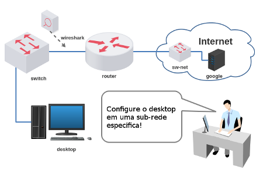
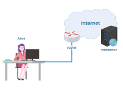
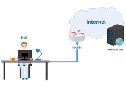

# Lab. Estudo 3A - Endereçamento IP

Tema: Endereçamento IP

Objetivo:

Aprender a endereçar dispositivos de redes quando há máscaras com tamanhos variáveis (VLSM).

Enunciado:

Busque solucionar o endereçamento de rede que utiliza máscaras de classe C de /25 à /30. Carregue o laboratório e faça diversos testes para melhor assimilação.

**Passo 1**

Faça o download do laboratório abaixo e execute no livelinux: 

[lab_estudo_3a.tar.gz](./lab_estudo_3a.tar.gz)

**Passo 2**

Esta é uma topologia simples em que uma estação precisa ser configurada para ter acesso à Internet, porém, agora, será necessário trabalhar com máscaras de tamanho variável. Pesquise!

Você saberia responder:

O endereço IP está em qual camada do Modelo TCP/IP? 

**Passo 3**

Configure essa topologia quantas vezes desejar, porém, sugere-se que você identifique as seguintes informações a cada configuração:

a) Qual é o endereço da sub-rede (ID)?

b) Qual é a máscara de sub-rede?

c) Qual é o 1º endereço IP?

d) Qual é o 1º endereço IP atribuível?

e) Qual é o Nº endereço IP atribuível?

f) Qual é o endereço IP de broadcast?

g) Quantos endereços atribuíveis possui essa sub-rede? '

**Passo 4**

Laboratórios Práticos:

Caso queira treinar antes da prova, você pode testar os seus conhecimentos com os laboratórios abaixo como se estivesse fazendo a prova prática:

[lab_prat_3a_1.tar.gz](./lab_prat_3a_1.tar.gz)

[lab_prat_3a_2.tar.gz](./lab_prat_3a_2.tar.gz)

Bons estudos!!! :-}

