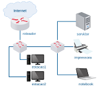
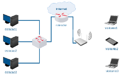
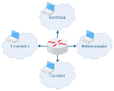

# Lab. Estudo 3B - Endereçamento IP

Tema: Endereçamento IP 

Objetivo:

Aprender a distribuir blocos de endereços IPs em sub-redes.

Enunciado:

Resolva a lista de endereçamento IP e, se possível, configure os laboratórios para melhor fixação. 

**Passo 1**

Faça o download da lista de exercícios de endereçamento IP: 

[lista_estudo_3b.odt](lista_estudo_3b.odt)

[lista_estudo_3b.pdf](lista_estudo_3b.pdf)

Gere os endereços IPs que serão atribuídos na lista utilizando o script:

[gerarips.pl](gerarips.pl)

`perl gerarips.pl`

Pode executar online também: [Online Perl](http://tpcg.io/_3J28EU).

**Passo 2**

Caso queira resolver a lista praticando, você poderá usar os seguintes laboratórios: 

Exercícios 01-03: 

[lab_estudo_3b1.tar.gz](lab_estudo_3b1.tar.gz)

Exercícios 04-07: 

[lab_estudo_3b2.tar.gz](lab_estudo_3b2.tar.gz)

Exercícios 08-10: 

[lab_estudo_3b3.tar.gz](lab_estudo_3b3.tar.gz)

**Passo 3**

Laboratório Prático:

Caso queira treinar antes da prova, você pode testar os seus conhecimentos com o laboratório abaixo como se estivesse fazendo a prova prática:

[lab_prat_3b.tar.gz](./lab_prat_3b.tar.gz)

Bons estudos!!! :-}

