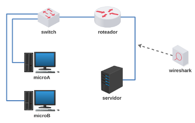
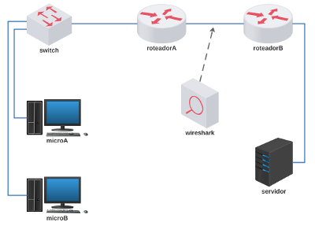

# Lab.Aula 07 - Protocolos de Transporte

**Passo 1**

Faça o download do laboratório abaixo e execute no livelinux: 

[lab_aula_7.tar.gz](./lab_aula_7.tar.gz)

Em um segundo momento refazer este laboratório com um roteador a mais para fixar comandos Quagga:

[lab_aula_7b.tar.gz](./lab_aula_7b.tar.gz)

Opcional, scripts utilizados neste lab.: [tcp_udp.tar.gz](tcp_udp.tar.gz)

**Passo 2**

Descompacte e execute como de costume.

**Passo 3**

Utilize a ferramenta netcat para trocar segmentos TCP/UDP entre o servidor e os micros. 

**Passo 4**

Siga as instruções de aula:

[Redes 1 - APNP 14a - Topologia + Roteador Quagga (parte 1)](https://www.youtube.com/watch?v=smAzOmDxsVY)

[Redes 1 - APNP 15a - TCP e UDP (parte 1)](https://www.youtube.com/watch?v=QDpfp4TYzys)

[Redes 1 - APNP 15b - TCP e UDP (parte 2)](https://www.youtube.com/watch?v=-HXcnvoXuBQ)

[Redes 1 - APNP 15c - TCP e UDP (parte 3)](https://www.youtube.com/watch?v=IX1PCRKVXSE)

[Redes 1 - APNP 14b - Topologia + Roteador Quagga (Parte 2)](https://www.youtube.com/watch?v=DglT_mnIHhY)

[Redes 1 - APNP 15d - TCP e UDP (parte 4)](https://www.youtube.com/watch?v=I4corSBQZ9I)

[Redes 1 - APNP 15e - TCP e UDP (parte 5)](https://www.youtube.com/watch?v=QfKe5XL6Chg)

[Redes 1 - APNP 15f - TCP e UDP (parte 6)](https://www.youtube.com/watch?v=kqzz4QVa77Y)

[Redes 1 - APNP 15g - TCP e UDP (parte 7)](https://www.youtube.com/watch?v=xV0GXKG7GCY)

[Redes 1 - APNP 15h - TCP e UDP (parte 8)](https://www.youtube.com/watch?v=GLXGw5fNZiM)

Bons estudos!!!

