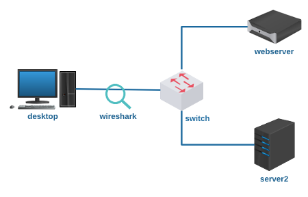
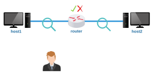

# Lab. Estudo 3C - Roteamento e TCP/UDP

Tema: Roteamento e Protocolos TCP/UDP

Objetivo:

Aprender como funcionam os dois principais protocolos de transporte da Internet, o TCP e o UDP.

Enunciado:

Carregue os dispositivos do laboratório virtual e utilize a ferramenta wireshark para estudar o cabeçalho dos datagramas TCP e UDP. 

**Passo 1**

Faça o download do laboratório abaixo e execute no livelinux: 

[lab_estudo_3c.tar.gz](lab_estudo_3c.tar.gz)

**Passo 2**

Esta topologia já está configurada, o webserver possui serviços HTTP e DNS habilitados e o server2 possui a ferramenta netcat.

Antes de prosseguir com a parte prática busque mais informações em livros e nos documentos RFCs dos protocolos TCP e UDP.

Você saberia responder:

Em qual camada do Modelo OSI se encontra o TCP?

Em qual camada do Modelo TCP/IP se encontra o UDP?

**Passo 3**

Os comandos a seguir podem auxiliar no estudo dos protocolos TCP e UDP. Porém, identificar a utilidade de cada campo dos cabeçalhos vai depender do seu interesse e da sua desenvoltura, tenha em mãos os documentos RFCs e "escove os bits" com a ferramenta wireshark. Bom trabalho!

a) Serviço DNS:

`desktop# dig @10.0.0.1 localhost A`

Inspecione o protocolo de transporte!

b) Serviço WEB:

`desktop# links 10.0.0.1`

Inspecione o protocolo de transporte!

c) Netcat:

`server2# nc -l -p 8000`

-> adicione "-u" para UDP

`desktop# nc 10.0.0.2 8000`

-> adicione "-u" para UDP

Envie mensagens e inspecione o protocolo de transporte.

d) Transferência de arquivos via Netcat:

Gere um arquivo de 10KB:

`server2# dd if=/dev/urandom of=arquivo.bin bs=1K count=10`

Verifique:

`server2# cksum arquivo.bin`

Forneça o arquivo via TCP:

`server2# nc -l -p 3000 -q 0 < arquivo.bin`

Faça o download:

`desktop# nc 10.0.0.2 3000 > arquivo.bin`a

Confira:

`desktop# cksum arquivo.bin`

Inspecione os segmentos e depois faça um teste com UDP.

**Passo 4**

Laboratório Prático:

Caso queira treinar antes da prova, você pode testar os seus conhecimentos com o laboratório abaixo como se estivesse fazendo a prova prática:

[lab_prat_3c.tar.gz](./lab_prat_3c.tar.gz)

Bons estudos!!! :-}

