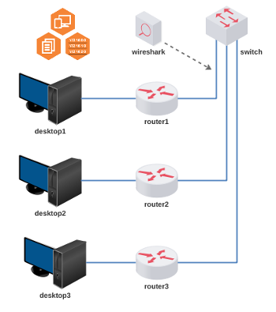
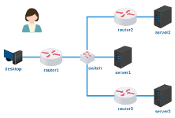

# Lab. Estudo 3D - Roteamento e TCP/UDP

Tema: Roteamento e Protocolos TCP/UDP

Objetivo:

Aprender como funciona o roteamento com a ferramenta Quagga que é similar aos sistemas da Cisco.

Enunciado:

Você é o responsável por uma rede de uma certa empresa que ainda não está configurada; você deverá distribuir os endereços IPs e fazer a configuração de roteamento.

**Passo 1**

Faça o download do laboratório abaixo e execute no livelinux: 

[lab_estudo_3d.tar.gz](lab_estudo_3d.tar.gz)

**Passo 2**

Este laboratório não traz novidades no que se trata de protocolos, apenas um novo ambiente de configuração.

Antes de configurar a topologia, faça a subdivisão do bloco de endereço IP para os domínios de broadcast. Utilize o bloco _IP11_ que pode ser gerado conforme script do Passo 1 do *Laboratório de Estudo 3B*. 

Você saberia responder:

Quantos são os domínios de broadcast nessa topologia?

**Passo 3**

O objetivo é simples, configure o endereçamento e o roteamento para que todos os dispositivos estejam alcançáveis entre si. 

Verificar interfaces:

`router# show interfaces`

Endereçar interfaces:

`router# configure terminal`

`router(config)# interface eth0`

`router(config-if)# ip address 200.0.0.10/24`

Verificar tabela de roteamento:

`router# show ip route`

Adicionar uma nova rota:

`router# configure terminal`

`router(config)# ip route 200.0.1.0/24 200.0.0.2`

Tente alcançar o objetivo! Bom trabalho! 

**Passo 4**

Laboratório Prático:

Caso queira treinar antes da prova, você pode testar os seus conhecimentos com o laboratório abaixo como se estivesse fazendo a prova prática:

[lab_prat_3d.tar.gz](./lab_prat_3d.tar.gz)

Bons estudos!!! :-}

