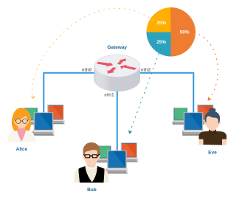
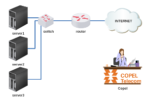
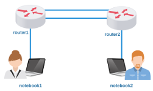
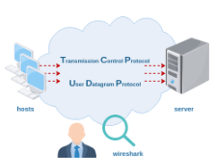
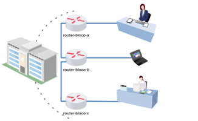

# Terceira Avaliação - Prática

Objetivo: resolver laboratórios práticos e obter seus tickets. 

**Orientações**

1) Cada laboratório deverá ser executado no LiveLinux xbnet 2.9;

2) Preste atenção quando for carregar o laboratório, preencha corretamente o seu primeiro nome e o seu RA;

3) Estimativa de 15 minutos para resolver cada um dos laboratórios - se estudou antes;

4) Assim que resolver um laboratório salve seu ticket;

*Curiosidade: uma vez que o laboratório era resolvido, o mesmo gerava um ticket/comprovante que continha informações cifradas sobre sua solução, o qual eu utilizava para validar se o(a) aluno(a) havia resolvido a prova.*

5) Procure fechar cada laboratório clicando no "x" da janela que foi carregada, assim você não precisará reiniciar o LiveLinux;

*Obs.: ou seja, não feche o terminal diretamente.*

6) Se por acaso lhe pedirem ajuda, dê dicas, mas não dê a resposta.

7) Sinta-se desafiado(a) a resolver sozinho(a)! Boa prova! 

**Laboratório 3A**

Favor! Faça a subdivisão de endereços IPs! 

[lab_avaliacao_3a.tar.gz](./lab_avaliacao_3a.tar.gz)

**Laboratório 3B**

Alô! Aqui é da Telecom! Já disponibilizamos o acesso da sua empresa para a Internet! 

[lab_avaliacao_3b.tar.gz](./lab_avaliacao_3b.tar.gz)

**Laboratório 3C**

Como resolver o roteamento?! 

[lab_avaliacao_3c.tar.gz](./lab_avaliacao_3c.tar.gz)

**Laboratório 3D**

Vamos inspecionar datagramas e segmentos? 

[lab_avaliacao_3d.tar.gz](./lab_avaliacao_3d.tar.gz)

**Laboratório 3E**

Estamos com problemas na rede do Colégio! Poderia nos ajudar? 

[lab_avaliacao_3e.tar.gz](./lab_avaliacao_3e.tar.gz)

