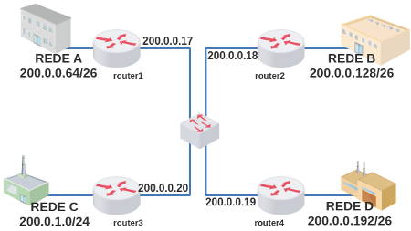
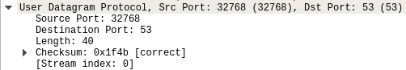
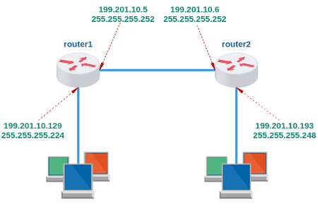
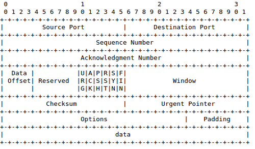
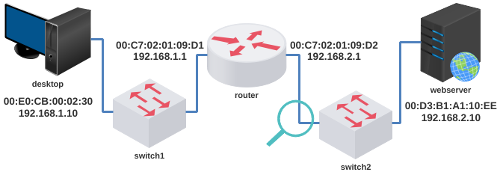

# Terceira Avaliação - Teórica
 
**Conteúdo:**  
\- Básico: Modelos OSI e TCP/IP; Protocolos Ethernet, ARP, IP e ICMP.  
\- Principal: Roteamento e Endereçamento IP, TCP e UDP.  
\- Listas de Exercícios 3A e 3B.  
  
Bom teste! :)

**Questões**

* * *

13

Quais dos endereços abaixo são endereços de broadcast?  
  
20.0.10.255/8  
140.0.255.0/16  
234.255.255.255  
38.255.255.255  
120.10.40.20/24  
130.254.254.255  
100.255.255.255/16  
201.150.20.255/8  
210.255.255.210

(  )

201.150.20.255/8 e 100.255.255.255/16

(  )

20.0.10.255/8 e 234.255.255.255

(  )

Somente 38.255.255.255

(  )

20.0.10.255/8 e 234.255.255.255

(  )

38.255.255.255 e 100.255.255.255/16

(  )

Somente 234.255.255.255

(  )

201.150.20.255/8 e 120.10.40.20/24

(  )

38.255.255.255 e 130.254.254.255

(  )

Todos, exceto 210.255.255.210, 140.0.255.0/16 e 120.10.40.20/24

(  )

38.255.255.255 e 234.255.255.255

* * *

12

De acordo com a topologia abaixo responda:  
  
  
  
Como seria a configuração de uma rota no router1 para alcançar a rede D?

(  )

router1-zebra(config)# ip route 200.0.0.192/26 200.0.0.19

(  )

router1-zebra(config)# ip route 200.0.0.192/24 200.0.0.19/24

(  )

router1-zebra(config)# ip route 200.0.1.192/26 200.0.0.19/30

(  )

router1-zebra(config)# ip route 200.0.0.64/26 200.0.0.192/26

(  )

router1-zebra(config)# ip route 200.0.0.64/26 200.0.0.19

(  )

router1-zebra(config)# ip route 200.0.1.192/26 200.0.0.20

(  )

router1-zebra(config)# ip route 200.0.1.192/26 200.0.0.19/30

(  )

router1-zebra(config)# ip route 200.0.0.128/26 200.0.0.19

(  )

router1-zebra(config)# ip route 200.0.0.128/26 200.0.0.18

(  )

router1-zebra(config)# ip route 200.0.1.0/24 200.0.0.20

* * *

11

O que é verdade na comparação dos protocolos TCP e UDP?

(  )

\- Ambos são da Camada de Rede;  
\- O Protocolo UDP não retransmite segmentos perdidos;  
\- O Protocolo UDP não faz o controle de congestionamento;  
\- Ambos podem fazer a correção de erros.

(  )

\- Ambos são da Camada de Aplicação;  
\- O Protocolo TCP retransmite segmentos perdidos;  
\- O Protocolo UDP não faz o controle de congestionamento;  
\- Somente o protocolo TCP faz a correção de erros.

(  )

\- Ambos são da Camada de Transporte;  
\- O Protocolo UDP retransmite segmentos perdidos;  
\- O Protocolo TCP não faz o controle de congestionamento;  
\- Somente o protocolo TCP faz a detecção de erros.

(  )

\- Ambos são da Camada de Rede;  
\- O Protocolo TCP retransmite segmentos perdidos;  
\- O Protocolo TCP faz o controle de congestionamento;  
\- Ambos podem fazer a detecção de erros.

(  )

\- Ambos são da Camada de Aplicação;  
\- O Protocolo TCP retransmite segmentos perdidos;  
\- O Protocolo UDP faz o controle de congestionamento;  
\- Somente o protocolo TCP faz a correção de erros.

(  )

\- Ambos são da Camada de Transporte;  
\- O Protocolo UDP não retransmite segmentos perdidos;  
\- O Protocolo TCP não faz o controle de congestionamento;  
\- Somente o protocolo UDP faz a detecção de erros.

(  )

\- Ambos são da Camada de Transporte;  
\- O Protocolo UDP retransmite segmentos perdidos;  
\- O Protocolo TCP não faz o controle de congestionamento;  
\- Ambos podem fazer a detecção de erros.

(  )

\- Ambos são da Camada de Transporte;  
\- O Protocolo TCP retransmite segmentos perdidos;  
\- O Protocolo UDP não faz o controle de congestionamento;  
\- Ambos podem fazer a detecção de erros.

(  )

\- Ambos são da Camada de Rede;  
\- O Protocolo TCP retransmite segmentos perdidos;  
\- O Protocolo UDP não faz o controle de congestionamento;  
\- Somente o protocolo TCP faz a detecção de erros.

(  )

\- Ambos são da Camada de Aplicação;  
\- O Protocolo TCP retransmite segmentos perdidos;  
\- O Protocolo TCP faz o controle de congestionamento;  
\- Ambos podem fazer a detecção de erros.

* * *

10

Quais dos endereços IPs abaixo pertencem à Classe B?  
  
255.255.0.0  
192.1.100.1  
172.0.0.2  
127.10.1.1  
193.2.1.2  
126.255.1.1  
17.10.20.26  
128.235.7.9  
204.254.254.100  
8.8.8.8  
255.0.0.0

(  )

126.255.1.1, 172.0.0.2 e 255.255.0.0

(  )

127.10.1.1 e 255.255.0.0

(  )

172.0.0.2 e 128.235.7.9

(  )

255.255.0.0 e 255.0.0.0

(  )

8.8.8.8, 17.10.20.26, 126.255.1.1 e 127.10.1.1

(  )

192.1.100.1, 204.254.254.100 e 193.2.1.2

(  )

126.255.1.1 e 255.0.0.0

(  )

Somente o 8.8.8.8

(  )

193.2.1.2 e 192.1.100.1

(  )

17.10.20.26, 8.8.8.8 e 126.255.1.1

* * *

9

De acordo com o pacote capturado na figura abaixo responda:  
  
  
  
De acordo com o pacote capturado na figura abaixo responda:  
  
a) Qual camada?  
b) Há conexão?  
c) Fez a correção de erros?

(  )

a) Camada de Aplicação;  
b) Não há conexão;  
c) Sim, toda a informação de carga útil é válida.

(  )

a) Camada de Transporte;  
b) Há conexão;  
c) Não, toda a informação de carga útil é inválida.

(  )

a) Camada de Rede;  
b) Não há conexão;  
c) Não, apenas detectou erros.

(  )

a) Camada de Transporte;  
b) Há conexão;  
c) Não, apenas detectou erros.

(  )

a) Camada de Rede;  
b) Há conexão;  
c) Não, toda a informação de carga útil é inválida.

(  )

a) Camada de Transporte;  
b) Não há conexão;  
c) Não, apenas não detectou erros.

(  )

a) Camada de Rede;  
b) Não há conexão;  
c) Não, apenas não detectou erros.

(  )

a) Camada de Aplicação;  
b) Há conexão;  
c) Não, toda a informação de carga útil é inválida.

(  )

a) Camada de Rede;  
b) Não há conexão;  
c) Sim, toda a informação de carga útil é válida.

(  )

a) Camada de Transporte;  
b) Não há conexão;  
c) Sim, toda a informação de carga útil é válida.

* * *

8
  
A qual classe pertence cada um dos seguintes endereços IPs?  

a) 25.255.255.255  
b) 199.0.0.99  
c) 175.254.230.129  
d) 0.2.1.3  
e) 239.0.0.1

(  )

a) Classe C  
b) Classe B  
c) Classe B  
d) Classe E  
e) Classe D

(  )

a) Classe A  
b) Classe B  
c) Classe C  
d) Classe E  
e) Classe D

(  )

a) Classe A  
b) Classe B  
c) Classe B  
d) Classe E  
e) Classe D

(  )

a) Classe B  
b) Classe B  
c) Classe D  
d) Classe A  
e) Classe E

(  )

a) Classe A  
b) Classe C  
c) Classe B  
d) Classe A  
e) Classe D

(  )

a) Classe C  
b) Classe B  
c) Classe B  
d) Classe E  
e) Classe E

(  )

a) Classe C  
b) Classe C  
c) Classe C  
d) Classe A  
e) Classe C

(  )

a) Classe A  
b) Classe C  
c) Classe C  
d) Classe E  
e) Classe E

(  )

a) Classe A  
b) Classe C  
c) Classe C  
d) Classe A  
e) Classe C

(  )

a) Classe C  
b) Classe C  
c) Classe B  
d) Classe A  
e) Classe E

* * *

7

Observe a topologia abaixo e o endereçamento que foi atribuído e responda:  
  
  
  
Para que haja roteamento entre todas as redes, quais comandos estão corretos? Considere a ferramenta Quagga.

(  )

router1(config)# ip route 199.201.10.192/29 199.201.10.193  
router2(config)# ip route 199.201.10.128/28 199.201.10.129

(  )

router1(config)# ip route 199.201.10.192/30 199.201.10.193  
router2(config)# ip route 199.201.10.128/28 199.201.10.129

(  )

router1(config)# ip route 199.201.10.192/27 199.201.10.5  
router2(config)# ip route 199.201.10.128/29 199.201.10.6

(  )

router1(config)# ip route 199.201.10.192/28 199.201.10.6  
router2(config)# ip route 199.201.10.128/30 199.201.10.5

(  )

router1(config)# ip route 199.201.10.192/27 199.201.10.6  
router2(config)# ip route 199.201.10.128/29 199.201.10.5

(  )

router1(config)# ip route 199.201.10.192/27 199.201.10.193  
router2(config)# ip route 199.201.10.128/29 199.201.10.129

(  )

router1(config)# ip route 199.201.10.192/30 199.201.10.6  
router2(config)# ip route 199.201.10.128/27 199.201.10.5

(  )

router1(config)# ip route 199.201.10.192/30 199.201.10.6  
router2(config)# ip route 199.201.10.128/28 199.201.10.5

(  )

router1(config)# ip route 199.201.10.192/30 199.201.10.5  
router2(config)# ip route 199.201.10.128/28 199.201.10.6

(  )

router1(config)# ip route 199.201.10.192/29 199.201.10.6  
router2(config)# ip route 199.201.10.128/27 199.201.10.5

* * *

6

De acordo com o cabeçalho de um protocolo apresentado na figura abaixo, responda:  
  
  
  
Qual resposta melhor representa o estabelecimento de uma conexão?

(  )

1o Cliente para Servidor (URG=0,ACK=0,PSH=0,RST=0,SYN=1,FIN=0)  
2o Servidor para Cliente (URG=0,ACK=1,PSH=0,RST=0,SYN=1,FIN=0)  
3o Cliente para Servidor (URG=0,ACK=1,PSH=0,RST=0,SYN=1,FIN=1)

(  )

1o Cliente para Servidor (URG=0,ACK=0,PSH=0,RST=0,SYN=1,FIN=0)  
2o Servidor para Cliente (URG=0,ACK=1,PSH=0,RST=0,SYN=1,FIN=0)  
3o Cliente para Servidor (URG=0,ACK=1,PSH=0,RST=0,SYN=0,FIN=0)  
4o Servidor para Cliente (URG=1,ACK=0,PSH=0,RST=0,SYN=0,FIN=0)

(  )

1o Cliente para Servidor (URG=0,ACK=0,PSH=0,RST=0,SYN=1,FIN=0)  
2o Servidor para Cliente (URG=0,ACK=0,PSH=0,RST=0,SYN=1,FIN=0)

(  )

1o Cliente para Servidor (URG=0,ACK=0,PSH=0,RST=0,SYN=1,FIN=0)  
2o Servidor para Cliente (URG=0,ACK=1,PSH=0,RST=0,SYN=1,FIN=0)  
3o Cliente para Servidor (URG=0,ACK=1,PSH=0,RST=0,SYN=1,FIN=0)  
4o Servidor para Cliente (URG=1,ACK=0,PSH=0,RST=0,SYN=1,FIN=0)

(  )

1o Cliente para Servidor (URG=0,ACK=0,PSH=0,RST=0,SYN=1,FIN=0)  
2o Servidor para Cliente (URG=0,ACK=0,PSH=0,RST=0,SYN=1,FIN=0)  
3o Cliente para Servidor (URG=0,ACK=1,PSH=0,RST=0,SYN=0,FIN=1)

(  )

1o Cliente para Servidor (URG=0,ACK=0,PSH=0,RST=0,SYN=1,FIN=0)  
2o Servidor para Cliente (URG=0,ACK=1,PSH=0,RST=0,SYN=1,FIN=0)  
3o Cliente para Servidor (URG=0,ACK=1,PSH=0,RST=0,SYN=0,FIN=0)

(  )

1o Cliente para Servidor (URG=0,ACK=0,PSH=0,RST=0,SYN=1,FIN=0)  
2o Servidor para Cliente (URG=0,ACK=1,PSH=0,RST=0,SYN=1,FIN=0)  
3o Cliente para Servidor (URG=0,ACK=1,PSH=0,RST=0,SYN=1,FIN=0)

(  )

1o Cliente para Servidor (URG=0,ACK=0,PSH=0,RST=0,SYN=1,FIN=0)  
2o Servidor para Cliente (URG=0,ACK=0,PSH=0,RST=0,SYN=1,FIN=0)  
3o Cliente para Servidor (URG=0,ACK=1,PSH=0,RST=0,SYN=0,FIN=0)

(  )

1o Cliente para Servidor (URG=0,ACK=1,PSH=0,RST=0,SYN=1,FIN=0)  
2o Servidor para Cliente (URG=0,ACK=1,PSH=0,RST=0,SYN=1,FIN=0)

(  )

1o Cliente para Servidor (URG=0,ACK=0,PSH=0,RST=0,SYN=1,FIN=0)  
2o Servidor para Cliente (URG=0,ACK=1,PSH=0,RST=0,SYN=1,FIN=0)

* * *

5

Qual é a mascara padrão?  
  
a) de 172.49.107.254?  
b) de 126.10.0.1?  
c) de 215.0.0.140?

(  )

a) 255.255.255.0  
b) 255.255.0.0  
c) 255.255.255.0

(  )

a) 255.0.0.0  
b) 255.0.0.0  
c) 255.255.0.0

(  )

a) 255.255.255.0  
b) 255.255.0.0  
c) 255.0.0.0

(  )

a) 255.255.255.0  
b) 255.255.255.0  
c) 255.255.255.0

(  )

a) 255.255.0.0  
b) 255.0.0.0  
c) 255.255.255.0

(  )

a) 255.0.0.0  
b) 255.255.0.0  
c) 255.255.255.0

(  )

a) 255.0.0.0  
b) 255.0.0.0  
c) 255.255.255.0

(  )

a) 255.255.0.0  
b) 255.0.0.0  
c) 255.255.255.255

(  )

a) 255.255.0.0  
b) 255.0.0.0  
c) 255.0.255.0

(  )

a) 255.255.255.0  
b) 255.0.0.0  
c) 255.255.0.0

* * *

4

Você é o administrador de rede de uma nova loja de eletrodomésticos na cidade de Guarapuava � Paraná. Porém esta loja já contava com outras unidades nas cidades de Curitiba, Ponta Grossa e Cascavel. Todas essas unidades já possuíam suas redes configuradas com o bloco de endereço IP 200.134.120/24. O bloco de IP foi distribuído da seguinte maneira:  
  
Rede de Curitiba: 200.134.120.0/25  
Rede de Ponta Grossa: 200.134.120.128/27  
Rede de Cascavel: 200.134.120.192/26  
Link entre Curitiba e Ponta Grossa: 200.134.120.160/30  
Link entre P. Grossa e Guarapuava: 200.134.120.164/30  
Link entre Guarapuava e Cascavel: 200.134.120.168/30  
  
O administrador de rede da matriz (Curitiba) entrou em contato e solicitou para que você atribuísse o maior bloco de endereços IP de rede disponível para a cidade de Guarapuava. Responda: qual bloco será utilizado?

(  )

200.134.120.128/25

(  )

200.134.120.0/25

(  )

200.134.120.176/29

(  )

200.134.120.252/30

(  )

200.134.120.192/26

(  )

200.134.120.128/27

(  )

200.134.120.176/28

(  )

200.134.120.172/28

(  )

200.134.120.160/25

(  )

200.134.120.172/29

* * *

3

De acordo com a tabela de roteamento abaixo, responda:  

router# show ip route
  
Codes: K - kernel route, C - connected, S - static, R - RIP,
  
       O - OSPF, I - IS-IS, B - BGP, A - Babel,
  
       > - selected route, \* - FIB route
  
C>\* 127.0.0.0/8 is directly connected, lo
  
C>\* 200.201.1.0/24 is directly connected, eth0
  
C>\* 200.201.6.0/24 is directly connected, eth1
  
S>\* 200.201.17.0/24 \[1/0\] via 200.201.1.1, eth0
  
C>\* 200.201.29.0/24 is directly connected, eth2
  
S>\* 200.201.38.0/24 \[1/0\] via 200.201.6.2, eth1
  
router#
  
a) Um datagrama IP destinado para 200.201.38.179 será encaminhado para qual interface?  
b) Um datagrama IP destinado para 200.201.200.201 será encaminhado para qual interface?  
c) Um datagrama IP destinado para 200.201.17.130 será encaminhado para qual interface?

(  )

Marque "x":
  
a) ( )lo (x)eth0 ( )eth1 ( )eth2 ( )descarte
  
b) ( )lo ( )eth0 (x)eth1 ( )eth2 ( )descarte
  
c) ( )lo ( )eth0 (x)eth1 ( )eth2 ( )descarte

(  )

Marque "x":
  
a) ( )lo ( )eth0 (x)eth1 ( )eth2 ( )descarte
  
b) (x)lo ( )eth0 ( )eth1 ( )eth2 ( )descarte
  
c) ( )lo (x)eth0 ( )eth1 ( )eth2 ( )descarte

(  )

Marque "x":
  
a) ( )lo (x)eth0 ( )eth1 ( )eth2 ( )descarte
  
b) (x)lo ( )eth0 ( )eth1 ( )eth2 ( )descarte
  
c) ( )lo ( )eth0 ( )eth1 (x)eth2 ( )descarte

(  )

Marque "x":
  
a) ( )lo ( )eth0 ( )eth1 (x)eth2 ( )descarte
  
b) ( )lo ( )eth0 ( )eth1 ( )eth2 (x)descarte
  
c) ( )lo (x)eth0 ( )eth1 ( )eth2 ( )descarte

(  )

Marque "x":
  
a) ( )lo (x)eth0 ( )eth1 ( )eth2 ( )descarte
  
b) (x)lo ( )eth0 ( )eth1 ( )eth2 ( )descarte
  
c) ( )lo ( )eth0 (x)eth1 ( )eth2 ( )descarte

(  )

Marque "x":
  
a) ( )lo ( )eth0 (x)eth1 ( )eth2 ( )descarte
  
b) ( )lo ( )eth0 (x)eth1 ( )eth2 ( )descarte
  
c) ( )lo (x)eth0 ( )eth1 ( )eth2 ( )descarte

(  )

Marque "x":
  
a) ( )lo ( )eth0 (x)eth1 ( )eth2 ( )descarte
  
b) ( )lo ( )eth0 ( )eth1 (x)eth2 ( )descarte
  
c) ( )lo (x)eth0 ( )eth1 ( )eth2 ( )descarte

(  )

Marque "x":
  
a) ( )lo ( )eth0 ( )eth1 ( )eth2 (x)descarte
  
b) ( )lo ( )eth0 (x)eth1 ( )eth2 ( )descarte
  
c) ( )lo ( )eth0 (x)eth1 ( )eth2 ( )descarte

(  )

Marque "x":
  
a) ( )lo (x)eth0 ( )eth1 ( )eth2 ( )descarte
  
b) ( )lo ( )eth0 (x)eth1 ( )eth2 ( )descarte
  
c) ( )lo ( )eth0 ( )eth1 (x)eth2 ( )descarte

(  )

Marque "x":
  
a) ( )lo ( )eth0 (x)eth1 ( )eth2 ( )descarte
  
b) ( )lo ( )eth0 ( )eth1 ( )eth2 (x)descarte
  
c) ( )lo (x)eth0 ( )eth1 ( )eth2 ( )descarte

* * *

2

Quais máscaras deveriam ser utilizadas com os endereços IPs abaixo para que estes sejam considerados endereços de rede (ou seja, que identificam a rede)? Considere endereçamento Classless.  
  
a) 100.0.100.0  
b) 191.191.0.0  
c) 80.9.5.0

(  )

a) 255.255.255.0  
b) 255.255.255.0  
c) 255.255.255.0

(  )

a) 255.255.255.0  
b) 255.0.0.0  
c) 255.0.0.0

(  )

a) 255.255.0.0  
b) 255.255.0.0  
c) 255.255.255.0

(  )

a) 255.0.255.0  
b) 255.255.0.0  
c) 255.0.255.0

(  )

a) 255.255.255.0  
b) 255.0.0.0  
c) 255.255.255.0

(  )

a) 255.255.0.0  
b) 255.0.0.0  
c) 255.255.0.0

(  )

a) 255.0.0.0  
b) 255.255.0.0  
c) 255.255.255.0

(  )

a) 255.255.0.0  
b) 255.255.0.0  
c) 255.255.0.0

(  )

a) 255.0.0.0  
b) 255.255.0.0  
c) 255.0.0.0

(  )

a) 255.255.255.255  
b) 255.255.255.0  
c) 255.255.0.0

* * *

1

Na figura abaixo, a máquina desktop está realizando o acesso à uma página web hospedada na máquina webserver. Durante o acesso foi capturado um pacote entre o router e o switch2. Sabendo que nesse datagrama a origem do acesso é o desktop e que o destino é o webserver, responda:  
  
  
  
Como seriam identificados nas PDUs desse pacote ...  
a) os endereços MACs de origem e destino?  
b) os endereços IPs de origem e destino?  
c) os números de portas de origem e destino?  
  
Considere:  
\- Número de porta padrão IANA/IETF para acesso web, e demais acessos com portas altas.

(  )

a) origem 00:C7:02:01:09:D2 e destino 00:D3:B1:A1:10:EE  
b) origem 192.168.1.10 e destino 192.168.2.10  
c) origem 80 e destino 37231

(  )

a) origem 00:C7:02:01:09:D2 e destino 00:D3:B1:A1:10:EE  
b) origem 192.168.2.1 e destino 192.168.2.10  
c) origem 37231 e destino 80

(  )

a) origem 00:E0:CB:00:02:30 e destino 00:C7:02:01:09:D1  
b) origem 192.168.1.10 e destino 192.168.2.10  
c) origem 37231 e destino 80

(  )

a) origem 00:E0:CB:00:02:30 e destino 00:D3:B1:A1:10:EE  
b) origem 192.168.1.10 e destino 192.168.2.10  
c) origem 37231 e destino 80

(  )

a) origem 00:E0:CB:00:02:30 e destino 00:D3:B1:A1:10:EE  
b) origem 192.168.1.10 e destino 192.168.2.10  
c) origem 80 e destino 37231

(  )

a) origem 00:C7:02:01:09:D2 e destino 00:D3:B1:A1:10:EE  
b) origem 192.168.1.10 e destino 192.168.2.10  
c) origem 37231 e destino 80

(  )

a) origem 00:E0:CB:00:02:30 e destino 00:D3:B1:A1:10:EE  
b) origem 192.168.2.1 e destino 192.168.2.10  
c) origem 80 e destino 37231

(  )

a) origem 00:E0:CB:00:02:30 e destino 00:C7:02:01:09:D1  
b) origem 192.168.1.10 e destino 192.168.1.1  
c) origem 37231 e destino 80

(  )

a) origem 00:D3:B1:A1:10:EE e destino 00:E0:CB:00:02:30  
b) origem 192.168.2.10 e destino 192.168.1.10  
c) origem 80 e destino 37231

(  )

a) origem 00:C7:02:01:09:D1 e destino 00:D3:B1:A1:10:EE  
b) origem 192.168.1.1 e destino 192.168.2.10  
c) origem 37231 e destino 80

* * *

13=5; 12=1; 11=8; 10=3; 9=6; 8=5; 7=10; 6=6; 5=5; 4=7; 3=10; 2=1; 1=6.

