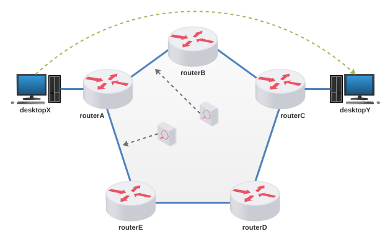

# Lab.Aula 08 - Roteamento Dinâmico (RIP/OSPF)

**Passo 1**

Faça o download do laboratório abaixo e execute no livelinux: 

[lab_aula_8.tar.gz](./lab_aula_8.tar.gz)

**Passo 2**

Descompacte e execute como de costume.

**Passo 3**

Siga as instruções de aula:

[Redes 1 - APNP 16a - Roteamento Dinâmico +RIP (parte 1)](https://www.youtube.com/watch?v=kN2o5s5JmJ8)

[Redes 1 - APNP 16b - Roteamento Dinâmico +RIP (parte 2)](https://www.youtube.com/watch?v=STBdgR1lMR0)

[Redes 1 - APNP 16c - Roteamento Dinâmico +RIP (parte 3)](https://www.youtube.com/watch?v=VHwBHHpo5j0)

[Redes 1 - APNP 16d - Roteamento Dinâmico +RIP (parte 4)](https://www.youtube.com/watch?v=DQ65HEsc8tM)

[Redes 1 - APNP 17a - Roteamento Dinâmico +OSPF (parte 1)](https://www.youtube.com/watch?v=RWYSJ4SZv5E)

[Redes 1 - APNP 17b - Roteamento Dinâmico +OSPF (parte 2)](https://www.youtube.com/watch?v=cO9B-d3gbaM)

[Redes 1 - APNP17c - Roteamento Dinâmico +OSPF (parte 3)](https://www.youtube.com/watch?v=aUNluA8ND40)

[Redes 1 - APNP 18 - Roteamento - Estado do Enlace +Slides](https://www.youtube.com/watch?v=87Rfvtnzo3s)

Bons estudos!!!

