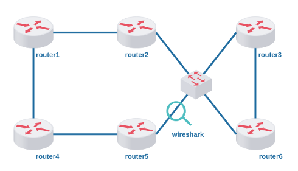
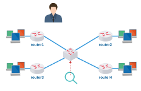

# Lab. Estudo 4A - Protocolos de Roteamento

Tema: Protocolos de Roteamento

Objetivo:

Aprender como funcionam os protocolos de roteamento RIP e OSPF.

Enunciado:

Execute a topologia redundante, faça uma configuração de roteamento com protocolo RIP e depois uma configuração com o protocolo OSPF. Utilize a ferramenta wireshark para inspecionar os protocolos. 

**Passo 1**

Faça o download do laboratório abaixo e execute no livelinux: 

[lab_estudo_4a.tar.gz](lab_estudo_4a.tar.gz)

**Passo 2**

Configure a topologia com o endereçamento que desejar e verifique se os roteadores alcançam seus roteadores vizinhos.

Importante:

Não crie rotas, pois serão criadas automaticamente. 

**Passo 3**

Configure o protocolo RIP!

A configuração de roteamento é simples, basta divulgar as redes que estão conectadas, exemplo:

`router1# configure terminal`

`router1(config)# router rip`

`router1(config-router)# network 192.168.0.0/24`

**Passo 4**

Utilize o wireshark e inspecione o protocolo RIP:

Procure responder: 

a) O protocolo RIP está em qual camada do Modelo OSI?

b) Qual é a distância administrativa utilizada pelo RIP?

c) Qual é a métrica de roteamento utilizada pelo RIP?

d) Qual o endereço MAC e o endereço IP de destino utilizado pelo RIP?

e) De quantos em quantos segundos o RIP divulga suas rotas para os vizinhos?

f) Qual protocolo de transporte e qual o porto padrão para o RIP? 

**Passo 5**

Desative o protocolo RIP:

`router1(config)# no router rip`

**Passo 6**

Da mesma maneira, agora configure o protocolo OSPF, exemplo:

`router1# configure terminal`

`router1(config)# router ospf`

`router1(config-router)# network 192.168.0.0/24 area 0`

**Passo 7**

Utilize o wireshark e inspecione o protocolo OSPF:

Procure responder:

a) O protocolo OSPF está em qual camada do Modelo OSI?

b) Qual é a distância administrativa utilizada pelo OSPF?

c) Qual é a métrica de roteamento utilizada pelo OSPF?

d) Qual o endereço MAC e o endereço IP de destino utilizado pelo OSPF?

e) Em qual momento o OSPF divulga suas rotas para os vizinhos? 

**Passo 8**

Um teste adicional, caso você queira fazer, é o teste de convergência.

Deixe o roteador 1 "pingando" o roteador 6 em sua rede mais interna (a rede com o roteador 3). Note que o roteamento será direcionado para o roteador 2. Para fazer o teste de convergência você poderá desativar uma das interfaces do roteador 2, por exemplo:

`router2(config)# interface eth1`

`router2(config-if)# shutdown`

Isso obrigará o protocolo de roteamento encontrar um caminho alternativo, através dos roteadores 4 e 5.

Calcule quantos pacotes são perdidos com RIP em comparação aos que são perdidos com OSPF. 

**Passo 9**

Laboratório Prático:

Caso queira treinar antes da prova, você pode testar os seus conhecimentos com o laboratório abaixo como se estivesse fazendo a prova prática:

[lab_prat_4a.tar.gz](./lab_prat_4a.tar.gz)

Bons estudos!!! :-}

