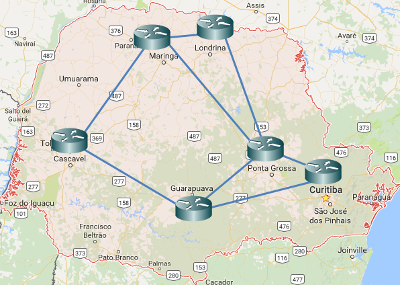
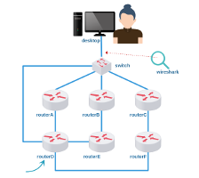
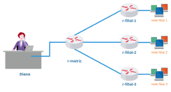

# Lab. Estudo 4B - Protocolos de Roteamento

Tema: Protocolos de Roteamento

Objetivo:

Aprender a configurar o protocolo OSPF e construir caminhos alternativos.

Enunciado:

Você é o responsável em distribuir um bloco de endereços IPs e configurar os roteadores de uma Empresa em Curitiba que contém diversos pontos (filiais) no Paraná. Configure o OSPF  para encontrar caminhos redundantes e distribua um bloco de endereços IPs de maneira eficiente. 

**Passo 1**

Faça o download do laboratório abaixo e execute no livelinux: 

[lab_estudo_4b.tar.gz](lab_estudo_4b.tar.gz)

Obs: cada roteador possui uma interface a mais do que apresentado na topologia, essa interface deve ser utilizada para atribuir um endereço IP para a LAN de cada cidade. 

**Passo 2**

A Empresa conta com um bloco de endereços IPs que deve ser subdividido para atender o seguinte:
- Curitiba precisará de no mínimo 50 endereços IPs.
- Ponta Grossa, Maringá e Cascavel precisarão de no mínimo 25 endereços IPs cada.
- Londrina e Guarapuava precisarão de no mínimo 10 endereços IPs cada.

Utilize um bloco de endereço IP gerado automaticamente, _IP11_ conforme Laboratório de Estudo 3B.

**Passo 3**

- Atribuir o primeiro endereço IP para cada cidade na interface que faz conexão com a LAN.
- Economizar endereços IPs quando for atribuir para as interfaces entre os roteadores. (Utilizar /30)
- Testar conectividade entre os roteadores. 

**Passo 4**

- Configurar roteamento OSPF area 0 (zero) entre os roteadores.
- Qual foi o caminho escolhido entre os roteadores para interconectar a rede de Cascavel até a rede de Curitiba? 

**Passo 5**

Modificar as métricas do protocolo OSPF para que o roteamento entre Cascavel e Curitiba faça o seguinte caminho:

Uma estação em Cascavel -> (Cascavel)->(Maringá)->(Londrina)->(Ponta Grossa)->(Guarapuava)->(Curitiba)-> uma estação em Curitiba ... e vice-versa.

Sugestão: 

Utilize os comandos
`ping ip_destino` e
`traceroute ip_destino`. 

**Passo 6**

Laboratório Prático:

Caso queira treinar antes da prova, você pode testar os seus conhecimentos com o laboratório abaixo como se estivesse fazendo a prova prática:

[lab_prat_4b_1.tar.gz](./lab_prat_4b_1.tar.gz)

[lab_prat_4b_2.tar.gz](./lab_prat_4b_2.tar.gz)

Bons estudos!!! :-}

