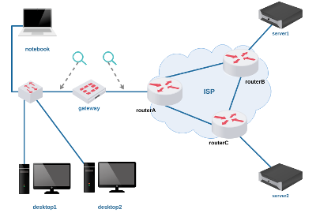

# Lab.Aula 09 - Endereçamento para Internet (NAT/DHCP)

**Passo 1**

Faça o download do laboratório abaixo e execute no livelinux: 

[lab_aula_9.tar.gz](./lab_aula_9.tar.gz)

**Passo 2**

Siga as instruções de aula:

[Redes 1 - APNP 19a - Endereçamento Dinâmico +DHCP (parte 1)](https://www.youtube.com/watch?v=z0529bZDKoM)

[Redes 1 - APNP 19b - Endereçamento Dinâmico +DHCP (parte 2)](https://www.youtube.com/watch?v=eVn8wr6L-s0)

[Redes 1 - APNP 19c - Endereçamento Dinâmico +DHCP (parte 3)](https://www.youtube.com/watch?v=cO4Nt8BH-ns)

[Redes 1 - APNP 20a - Tradução de Endereços +NAT (parte 1)](https://www.youtube.com/watch?v=fWx3dQ1r_F8)

[Redes 1 - APNP 20b - Tradução de Endereços +NAT (parte 2)](https://www.youtube.com/watch?v=6U07bJospLU)

[Redes 1 - APNP 20c - Tradução de Endereços +NAT (parte 3)](https://www.youtube.com/watch?v=DDkL9Q_Ix08)

Bons estudos!!!

