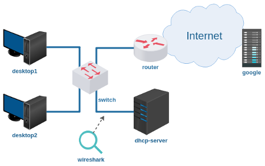

# Lab. Estudo 4C - Endereçamento para Internet

Tema: Endereçamento para Internet

Objetivo:

Aprender como funciona o protocolo DHCP.

Enunciado:

Configure o servidor DHCP de maneira que os desktops sejam ligados e, sem qualquer configuração, possam acessar o site www.google.com. 

**Passo 1**

Faça o download do laboratório abaixo e execute no livelinux: 



[lab_estudo_4c.tar.gz](lab_estudo_4c.tar.gz)

**Passo 2**

Antes de configurar este laboratório, pesquise como funciona o protocolo DHCP.

Você saberia responder:

Em qual camada do modelo ISO/OSI está o DHCP?

**Passo 3**

Ainda não carregue os desktops 1 e 2, antes configure o servidor DHCP, exemplo:

`dhcp-server# nano /etc/dhcp/dhcpd.conf`

```
subnet 200.100.100.0 netmask 255.255.255.0 {
   range 200.100.100.10 200.100.100.99;
   option routers 200.100.100.1;
   option domain-name-servers 8.8.8.8;
}
```

Uma vez configurado, reinicie o serviço DHCP. 

**Passo 4**

Agora carregue a ferramenta wireshark e carregue os desktops 1 e 2.

Note que os sistemas ReactOS e Slitaz irão configurar automaticamente o endereçamento IP, teste o acesso do navegador ao site www.google.com.

No caso do sistema Debian, digite na linha de comando: `dhclient eth0`.

Com a ferramenta wireshark verifique os tipos de mensagens DHCP, e em que momento estas foram utilizadas. 

Bons estudos!!! :-}

