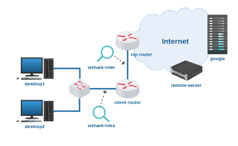

# Lab. Estudo 4D - Endereçamento para Internet

Tema: Endereçamento para Internet

Objetivo:

Aprender como funciona a tradução de endereços IPs (NAT).

Enunciado:

Configure o roteador do cliente de maneira que a sua rede local com endereços privados possa acessar a Internet com apenas um endereço IP público. 

**Passo 1**

Faça o download do laboratório abaixo e execute no livelinux: 

[lab_estudo_4d.tar.gz](lab_estudo_4d.tar.gz)

**Passo 2**

Antes de configurar este laboratório, pesquise como funciona a tradução de endereços IPs com NAT, utilize a Seção de Materiais.

Você saberia responder:

Qual é a diferença entre endereços IPs públicos e privados? 

**Passo 3**

Configure o roteador do cliente com uma interface com endereço IP público e outra interface com endereço IP privado.

Faça o endereçamento dos Desktops (caso queira o próprio roteador pode atribuir IPs com o DHCP).

Utilize blocos de endereços privados: 10/8, 172.16/12 ou 192.168/16. 

**Passo 4**

Antes de configurar o NAT, tente acessar algum serviço do servidor remoto a partir de uma estação (HTTP, DNS ou via netcat).

Inspecione com a ferramenta wireshark, observe os endereços IPs de origem e destino. Verifique também as portas de origem e destino. 

**Passo 5**

Agora configure a tradução de endereços IPs:

`client-router# iptables -t nat -I POSTROUTING -s [rede_privada] -o [interface_saída] -j MASQUERADE`

Mais uma vez inspecione endereços e portas com a ferramenta wireshark. Faça diversos testes, aperfeiçoe o seu conhecimento. 

Bons estudos!!! :-}

