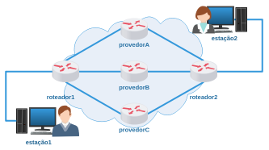

# Quarta Avaliação - Prática

Objetivo: resolver laboratórios práticos e obter seus tickets. 

**Orientações**

1) Cada laboratório deverá ser executado no LiveLinux xbnet 2.9;

2) Preste atenção quando for carregar o laboratório, preencha corretamente o seu primeiro nome e o seu RA;

3) Estimativa de 15 minutos para resolver cada um dos laboratórios - se estudou antes;

4) Assim que resolver um laboratório salve seu ticket;

*Curiosidade: uma vez que o laboratório era resolvido, o mesmo gerava um ticket/comprovante que continha informações cifradas sobre sua solução, o qual eu utilizava para validar se o(a) aluno(a) havia resolvido a prova.*

5) Procure fechar cada laboratório clicando no "x" da janela que foi carregada, assim você não precisará reiniciar o LiveLinux;

*Obs.: ou seja, não feche o terminal diretamente.*

6) Se por acaso lhe pedirem ajuda, dê dicas, mas não dê a resposta.

7) Sinta-se desafiado(a) a resolver sozinho(a)! Boa prova! 

**Laboratório 4A**

Favor! Configure o roteador com protocolo RIP! 

[lab_avaliacao_4a.tar.gz](./lab_avaliacao_4a.tar.gz)

**Laboratório 4B**

Caro ISP, favor configurar redundância com OSPF! 

[lab_avaliacao_4b.tar.gz](./lab_avaliacao_4b.tar.gz)

**Laboratório 4C**

Favor consertar o roteamento em nossa rede. 

[lab_avaliacao_4c.tar.gz](./lab_avaliacao_4c.tar.gz)

**Laboratório 4D**

Precisamos que você configure o roteador da Filial de nossa empresa! 

[lab_avaliacao_4d.tar.gz](./lab_avaliacao_4d.tar.gz)

**Laboratório 4E**

Agora sim, um verdadeiro desafio! Roteamento e NAT! 

[lab_avaliacao_4e.tar.gz](./lab_avaliacao_4e.tar.gz)

