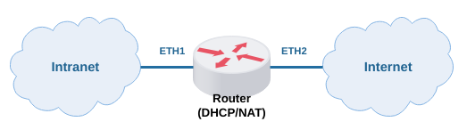
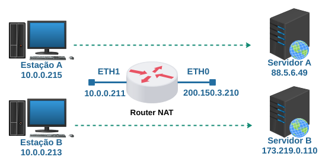
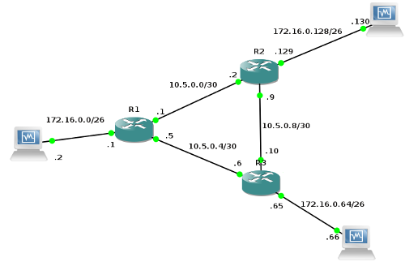
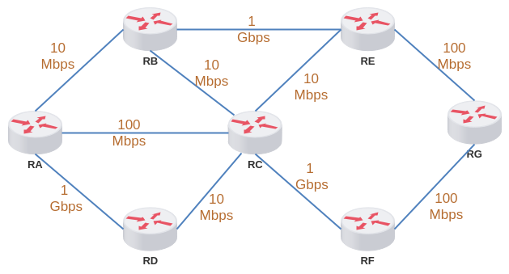
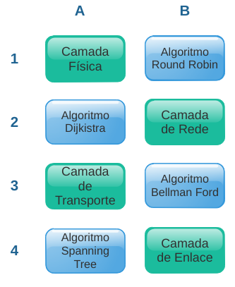

#  Quarta Reavaliação - Teórica

**Conteúdo:**  
\- Básico: Modelos OSI e TCP/IP; Protocolos Ethernet, ARP, IP, ICMP, TCP e UDP. Roteamento e Endereçamento.  
\- Principal: Roteamento Dinâmico com Quagga (RIP/OSPF), Endereçamento para Internet (DHCP/NAT).  
\- Listas de Exercícios 4A e 4B  
  
Bom teste! :)

**Questões**

* * *

10

Você é o responsável por configurar um roteador com DHCP e NAT para uma determinada empresa, conforme ilustra a figura abaixo:  
  
  
  
Considerando que você recebeu o primeiro endereço IP atribuível do bloco 200.210.9.176/30 para endereçar o roteador, e que o último endereço atribuível é de acesso ao provedor. Assim, qual configuração será a ideal para que a rede Intranet, usando de endereços privados, possa acessar serviços de rede na Internet?

(  )

1º Endereçar Eth2 com 200.210.9.177/30  
2º Roteamento Gateway para 200.210.9.178  
3º Endereçar Eth1 com 192.168.1.1/24  
4º Configurar servidor DHCP para alocar  
endereços no intervalo 192.168.1.2-192.168.1.254  
5º Configurar NAT com rede privada na ETH2  
e saída mascarada do IP na ETH1

(  )

1º Endereçar Eth2 com 200.210.9.177/30  
2º Roteamento Gateway para 200.210.9.178  
3º Endereçar Eth1 com 172.16.0.1/24  
4º Configurar servidor DHCP para alocar  
endereços no intervalo 172.16.0.2-172.17.0.254  
5º Configurar NAT com rede privada na ETH2  
e saída mascarada do IP na ETH1

(  )

1º Endereçar Eth1 com 200.210.9.177/30  
2º Roteamento Gateway para 200.210.9.178  
3º Endereçar Eth2 com 172.16.0.1/24  
4º Configurar servidor DHCP para alocar  
endereços no intervalo 172.16.0.1-172.16.0.254  
5º Configurar NAT com rede privada na ETH1  
e saída mascarada do IP na ETH2

(  )

1º Endereçar Eth2 com 200.210.9.178/30  
2º Roteamento Gateway para 200.210.9.179  
3º Endereçar Eth1 com 192.168.1.1/24  
4º Configurar servidor DHCP para alocar  
endereços no intervalo 192.168.1.2-192.168.1.254  
5º Configurar NAT com rede privada na ETH1  
e saída mascarada do IP na ETH2

(  )

1º Endereçar Eth2 com 200.210.9.178/30  
2º Roteamento Gateway para 200.210.9.177  
3º Endereçar Eth1 com 172.16.0.1/24  
4º Configurar servidor DHCP para alocar  
endereços no intervalo 172.16.0.2-172.17.0.254  
5º Configurar NAT com rede privada na ETH2  
e saída mascarada do IP na ETH1

(  )

1º Endereçar Eth2 com 200.210.9.177/30  
2º Roteamento Gateway para 200.210.9.178  
3º Endereçar Eth1 com 172.16.0.1/24  
4º Configurar servidor DHCP para alocar  
endereços no intervalo 172.16.0.2-172.17.0.254  
5º Configurar NAT com rede privada na ETH1  
e saída mascarada do IP na ETH2

(  )

1º Endereçar Eth2 com 200.210.9.178/30  
2º Roteamento Gateway para 200.210.9.179  
3º Endereçar Eth1 com 172.16.0.1/24  
4º Configurar servidor DHCP para alocar  
endereços no intervalo 172.16.0.2-172.17.0.254  
5º Configurar NAT com rede privada na ETH1  
e saída mascarada do IP na ETH2

(  )

1º Endereçar Eth1 com 200.210.9.177/30  
2º Roteamento Gateway para 200.210.9.176  
3º Endereçar Eth2 com 192.168.1.1/24  
4º Configurar servidor DHCP para alocar  
endereços no intervalo 192.168.1.1-192.168.1.254  
5º Configurar NAT com rede privada na ETH1  
e saída mascarada do IP na ETH2

(  )

1º Endereçar Eth2 com 200.210.9.178/30  
2º Roteamento Gateway para 200.210.9.177  
3º Endereçar Eth1 com 192.168.1.1/24  
4º Configurar servidor DHCP para alocar  
endereços no intervalo 192.168.1.2-192.168.1.254  
5º Configurar NAT com rede privada na ETH2  
e saída mascarada do IP na ETH1
 
(  )

1º Endereçar Eth2 com 200.210.9.177/30  
2º Roteamento Gateway para 200.210.9.178  
3º Endereçar Eth1 com 192.168.1.1/24  
4º Configurar servidor DHCP para alocar  
endereços no intervalo 192.168.1.2-192.168.1.254  
5º Configurar NAT com rede privada na ETH1  
e saída mascarada do IP na ETH2

* * *

9

Uma conexão TCP foi capturada na interface do roteador e apresentava os seguintes pacotes:  
  
Primeiro pacote, capturado na ETH1:  
TCP(SYN) 192.168.1.100:45991 para 201.14.208.77:80  
  
Segundo pacote, capturado na ETH0:  
TCP(SYN) 199.137.4.45:59002 para 201.14.208.77:80  
  
Terceiro pacote, capturado na ETH0:  
TCP(SYN,ACK) 201.14.208.77:80 para 199.137.4.45:59002  
  
Quarto pacote, capturado na ETH1:  
TCP(SYN,ACK) 201.14.208.77:80 para 192.168.1.100:45991  
  
Quinto pacote, capturado na ETH1:  
TCP(ACK) 192.168.1.100:45991 para 201.14.208.77:80  
  
Sexto pacote, capturado na ETH0:  
TCP(ACK) 199.137.4.45:59002 para 201.14.208.77:80  
  
O que não é verdade sobre esta conexão?

(  )

O endereço IP 201.14.208.77 é de um servidor WEB.

(  )

O endereço IP 192.168.1.100 foi traduzido para 199.137.4.45.

(  )

O endereço IP 192.168.1.100 é um endereço privado.

(  )

A porta de origem 45991 foi traduzida para a porta 59002.

(  )

É uma conexão TCP completa.

(  )

O endereço IP do destino 201.14.208.77 não precisou de tradução.

(  )

A porta de destino 80 não precisou de tradução.

(  )

A interface ETH1 está conectada a uma rede pública de Internet.

(  )

Possivelmente esta conexão TCP dará início a troca de mensagens HTTP na camada de aplicação.

(  )

A porta 45991 foi alocada por uma aplicação na estação de origem.

* * *

8

Considere que as estações ilustradas na figura abaixo estão em uma rede privada e que os servidores estão na Internet. Considere também que o roteador está com NAT configurado e permitindo o acesso à Internet normalmente. Então responda:  
  
  
  
1) Quais serão os endereços IPs de origem e de destino quando um pacote originado da Estação A chegar ao Servidor A?  
  
2) Quais serão os endereços IPs de origem e de destino quando um pacote destinado para o Servidor B estiver saindo da Estação B?

(  )

1) Origem 200.150.3.210 e destino 88.5.6.49  
2) Origem 10.0.0.213 e destino 10.0.0.211

(  )

1) Origem 10.0.0.215 e destino 10.0.0.211  
2) Origem 10.0.0.213 e destino 10.0.0.211

(  )

1) Origem 200.150.3.210 e destino 88.5.6.49  
2) Origem 173.219.0.110 e destino 10.0.0.211

(  )

1) Origem 10.0.0.215 e destino 88.5.6.49  
2) Origem 173.219.0.110 e destino 200.150.3.210

(  )

1) Origem 200.150.3.210 e destino 88.5.6.49  
2) Origem 173.219.0.110 e destino 10.0.0.213

(  )

1) Origem 200.150.3.210 e destino 88.5.6.49  
2) Origem 10.0.0.213 e destino 173.219.0.110

(  )

1) Origem 10.0.0.215 e destino 88.5.6.49  
2) Origem 200.150.3.210 e destino 173.219.0.110

(  )

1) Origem 10.0.0.215 e destino 88.5.6.49  
2) Origem 10.0.0.213 e destino 10.0.0.211

(  )

1) Origem 10.0.0.215 e destino 88.5.6.49  
2) Origem 173.219.0.110 e destino 10.0.0.213

(  )

1) Origem 200.150.3.210 e destino 88.5.6.49  
2) Origem 200.150.3.210 e destino 173.219.0.110

* * *

7

Marque a resposta certa:  
  
1ª) Não é verdade ao se comparar RIP com relação ao OSPF.  
  
2ª) É verdade ao se comparar OSPF com relação ao RIP.

(  )

1ª) O protocolo RIP possui uma visão da topologia apenas da perspectiva do roteador vizinho.  
2ª) O protocolo OSPF possui configuração simples.

(  )

1ª) O protocolo RIP possui uma convergência rápida em uma topologia de roteamento.  
2ª) O protocolo OSPF não tem problemas de contagem ao infinito.

(  )

1ª) O protocolo RIP possui uma convergência rápida em uma topologia de roteamento.  
2ª) O protocolo OSPF possui uma convergência lenta em uma topologia de roteamento.

(  )

1ª) O protocolo RIP possui configuração simples.  
2ª) O protocolo OSPF faz cópias de vetores de distância em largura de banda.

(  )

1ª) O protocolo RIP possui configuração simples.  
2ª) O protocolo OSPF não tem problemas de contagem ao infinito.

(  )

1ª) O protocolo RIP possui configuração simples.  
2ª) O protocolo OSPF possui uma convergência lenta em uma topologia de roteamento.

(  )

1ª) O protocolo RIP possui uma visão da topologia apenas da perspectiva do roteador vizinho.  
2ª) O protocolo OSPF faz cópias de vetores de distância em largura de banda.

(  )

1ª) O protocolo RIP pode causar problemas de contagem ao infinito.  
2ª) O protocolo OSPF possui configuração simples.

(  )

1ª) O protocolo RIP pode causar problemas de contagem ao infinito.  
2ª) O protocolo OSPF não tem problemas de contagem ao infinito.

(  )

1ª) O protocolo RIP pode causar problemas de contagem ao infinito.  
2ª) O protocolo OSPF faz cópias de vetores de distância em largura de banda.

* * *

6

Analise a tabela de roteamento ilustrada abaixo e responda:  

(1)C 210.15.21.64/28 is directly connected, Ethernet0
  
(2)C 210.15.21.128/25 is directly connected, Ethernet1
  
(3)C 210.15.21.0/29 is directly connected, Ethernet2
  
(4)S 210.15.21.0/26 \[1/0\] via 210.15.21.130
  
(5)R 210.15.21.192/26 \[120/2\] via 210.15.21.5
  
(6)O 210.15.21.64/27 \[110/1000\] via 210.15.21.2
  
(7)O 210.15.21.192/26 \[110/1000\] via 210.15.21.2
  
(8)R 210.15.21.0/26 \[120/1\] via 210.15.21.5

a) Um pacote destinado para 210.15.21.100 será encaminhado para qual interface de saída?  
  
b) Um pacote destinado para 210.15.21.35 será encaminhado para qual interface de saída?  
  
Obs: considere o bloco de endereços IPs e a distância administrativa para escolher o melhor caminho.  

(  )

a) Ethernet2  
b) Descarte

(  )

a) Ethernet2  
b) Ethernet0

(  )

a) Descarte  
b) Ethernet1

(  )

a) Ethernet1  
b) Ethernet2

(  )

a) Descarte  
b) Ethernet2

(  )

a) Ethernet1  
b) Descarte

(  )

a) Ethernet1  
b) Ethernet1

(  )

a) Ethernet0  
b) Ethernet0

(  )

a) Ethernet0  
b) Ethernet2
 
(  )

a) Ethernet0  
b) Ethernet1

* * *

5

Considere a seguinte configuração de um servidor DHCP (aplicação da Internet Society):  

subnet 204.254.239.64 netmask 255.255.255.224 {
  
   range 204.254.239.66 204.254.239.92;
  
   option routers 204.254.239.65;
  
}
  
Responda:  
a) Quantos endereços IPs este servidor permitirá alocar?  
b) Quantos endereços IPs atribuíveis não serão alocados por este servidor?

(  )

a) 27  
b) 2

(  )

a) 25  
b) 2

(  )

a) 25  
b) 3

(  )

a) 26  
b) 5

(  )

a) 27  
b) 3

(  )

a) 26  
b) 4

(  )

a) 26  
b) 2

(  )

a) 25  
b) 4

(  )

a) 27  
b) 4

(  )

a) 26  
b) 3

* * *

4

As seguintes mensagens DHCP foram encontradas em documento RFC:  
  
1 - DHCPACK  
2 - DHCPDECLINE  
3 - DHCPDISCOVER  
4 - DHCPINFORM  
5 - DHCPOFFER  
6 - DHCPREQUEST  
7 - DHCPRELEASE  
8 - DHCPNACK  
  
Qual será a sequência de mensagens quando um cliente DHCP vai interagir pela primeira vez com um determinado servidor DHCP?

(  )

4,1

(  )

3,5,6,1

(  )

4,8

(  )

3,5,4,8

(  )

5,2,7,8

(  )

6,5,3,1

(  )

3,4,6,1

(  )

6,1

(  )

7,8

(  )

4,6,7,2

* * *

3

De acordo com a topologia abaixo, como ficaria a divulgação de roteamento no roteador 2 com o protocolo OSPF utilizando a ferramenta Quagga?  
  
  
  
(  )

(config)# router ospf  
(config-router)# network 172.16.0.0/26 area 0

(  )

(config)# router ospf  
(config-router)# network 172.16.0.0/26 area 0  
(config-router)# network 10.5.0.4/30 area 0  
(config-router)# network 172.16.0.64/26 area 0

(  )

(config)# router ospf  
(config-router)# network 172.16.0.128/26 area 0  
(config-router)# network 10.5.0.8/30 area 0  
(config-router)# network 172.16.0.64/26 area 0

(  )

(config)# router ospf  
(config-router)# network 172.16.0.128/26 area 0  
(config-router)# network 10.5.0.8/30 area 0  
(config-router)# network 10.5.0.0/30 area 0

(  )

(config)# router ospf  
(config-router)# network 172.16.0.128/26 area 0

(  )

(config)# router ospf  
(config-router)# network 172.16.0.0/26 area 0  
(config-router)# network 10.5.0.4/30 area 0  
(config-router)# network 10.5.0.0/30 area 0

(  )

(config)# router ospf  
(config-router)# network 172.16.0.64/26 area 0  
(config-router)# network 10.5.0.4/30 area 0  
(config-router)# network 10.5.0.8/30 area 0

(  )

(config)# router ospf  
(config-router)# network 10.5.0.4/30 area 0  
(config-router)# network 10.5.0.0/30 area 0  
(config-router)# network 10.5.0.8/30 area 0

(  )

(config)# router ospf  
(config-router)# network 172.16.0.128/26 area 0  
(config-router)# network 172.16.0.0/26 area 0  
(config-router)# network 172.16.0.64/26 area 0

(  )

(config)# router ospf  
(config-router)# network 172.16.0.64/26 area 0

* * *

2

De acordo com a topologia apresentada na figura abaixo, responda:  
  
  
  
Qual será o melhor caminho entre o Roteador A e o Roteador E se for utilizado o protocolo OSPF?  
  
Obs: considere o custo de referência = (10^9/BW).

(  )

RA - RB - RE

(  )

RA - RC - RE

(  )

RA - RC - RE - RG

(  )

RA - RC - RF - RG

(  )

RA - RB - RC - RE

(  )

RA - RD - RC - RE

(  )

RA - RC - RB - RE

(  )

RA - RD - RC - RE - RG

(  )

RA - RD - RC - RF - RG

(  )

RA - RC - RF - RG - RE

* * *

1

De acordo com a figura abaixo, faça a correlação e responda:  
  
  
  
Quais frases estão corretas com relação aos protocolos de roteamento RIP e OSPF?

(  )

O protocolo RIP está na A1 e implementa o B1.  
O protocolo OSPF está na B3 e implementa o A2.

(  )

O protocolo RIP está na B2 e implementa o B3.  
O protocolo OSPF está na B2 e implementa o A4.

(  )

O protocolo RIP está na A3 e implementa o A2.  
O protocolo OSPF está na B2 e implementa o B3.

(  )

O protocolo RIP está na A1 e implementa o B1.  
O protocolo OSPF está na A1 e implementa o B3.

(  )

O protocolo RIP está na B2 e implementa o A2.  
O protocolo OSPF está na A3 e implementa o B3.

(  )

O protocolo RIP está na A3 e implementa o A4.  
O protocolo OSPF está na A3 e implementa o B3.

(  )

O protocolo RIP está na B4 e implementa o B1.  
O protocolo OSPF está na B2 e implementa o A2.

(  )

O protocolo RIP está na B4 e implementa o A2.  
O protocolo OSPF está na B4 e implementa o A4.

(  )

O protocolo RIP está na B4 e implementa o A3.  
O protocolo OSPF está na B2 e implementa o B1.

(  )

O protocolo RIP está na B2 e implementa o B3.  
O protocolo OSPF está na B2 e implementa o A2.

* * *

10=10; 9=8; 8=6; 7=2; 6=3; 5=5; 4=2; 3=4; 2=10; 1=10.

